<h2 align="center">Brian's JavaScript Tutorial</h2>
 
<!--~~~~~~~~~~~~~~~~~~~~~~~~~~~~~~~~~~~~~~~~~~~~~~~~~~~~~~~~~~~~~~~~~~~~~~~~~~~~~~~~~~~~~~~~~~~~-->
<!--~~~~~~~~~~~~~~~~~~~~~~~~~~~~~~~~~~~~~ readme.md of js ~~~~~~~~~~~~~~~~~~~~~~~~~~~~~~~~~~~~~~-->
<!--~~~~~~~~~~~~~~~~~~~~~~~~~~~~~~~~~~~~~~~~~~~~~~~~~~~~~~~~~~~~~~~~~~~~~~~~~~~~~~~~~~~~~~~~~~~~-->
<!--~~~~~~~~~~~~~~~~~~~~~~~~~~ 01. logo: university cote d'azure (01) ~~~~~~~~~~~~~~~~~~~~~~~~~~-->
<!-- 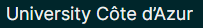{width="2.1145833333333335in" height="0.2916666666666667in"} -->

You don't need to wait until your pages are finalized; inserting a table
of contents can be an

> *This doc isn't just for reading, it's for trying too. Watch for the
> **Try it** text in red throughout this document so you can learn by
> doing.*

# 

Contents

[Insert a table of contents 1](#insert-a-table-of-contents)

[Update when things change 2](#update-when-things-change)

[Dive deeper than Heading 1 3](#dive-deeper-than-heading-1)

[Customize your TOC 3](#customize-your-toc)

[Remove a TOC 4](#remove-a-toc)

[Explore more 5](#explore-more)

> [Change text formatting of the TOC entries
> 5](#change-text-formatting-of-the-toc-entries)
>
> [Change the number of TOC levels 6](#change-the-number-of-toc-levels)

[Get help in Word 7](#get-help-in-word)

[Let us know what you think 7](#let-us-know-what-you-think)

# 

# Insert a table of contents

To add a TOC (short for *table of contents*), just decide where you want
it. Word will do the heavy lifting.

**Try It:** Hit Enter after the first paragraph in this doc to get a new
line. Then, go to the **References** tab, select **Table of Contents**,
and choose a TOC from the gallery.
<!--~~~~~~~~~~~~~~~~~~~~~~~~~~~~~~~~~~~~~~~~~~~~~~~~~~~~~~~~~~~~~~~~~~~~~~~~~~~~~~~~~~~~~~~~~~~~-->
<!--~~~~~~~~~~~~~~~~~~~~~~~~~~ 02.  (xx) ~~~~~~~~~~~~~~~~~~~~~~~~~~~~-->

<!-- 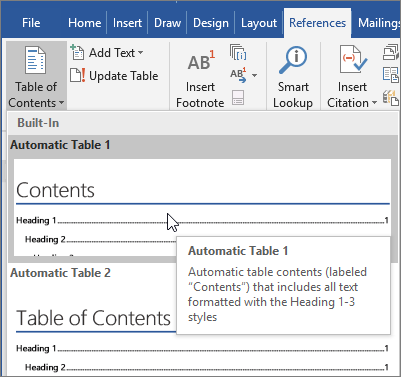{width="3.595754593175853in"
height="3.380547900262467in"} -->

*Voila!* Word found all the headings in this document and added a TOC.

# Update when things change

The heavy lifting doesn't stop with creating a TOC. Word is smart enough
to keep track of where things are, so you don't have to. When things
change, just update the TOC.

**Try It:** Update your TOC.

1.  Place your cursor after the paragraph that ends with, "When things
    change, just update the TOC" (above), and then hit Ctrl+Enter to
    push this section onto page 3.

2.  Go to your TOC and click anywhere in it. Then click **Update
    Table**, and click **OK** (**Update page numbers only** is selected
    by default).

<!--~~~~~~~~~~~~~~~~~~~~~~~~~~~~~~~~~~~~~~~~~~~~~~~~~~~~~~~~~~~~~~~~~~~~~~~~~~~~~~~~~~~~~~~~~~~~-->
<!--~~~~~~~~~~~~~~~~~~~~~~~~~~ 03.  (xx) ~~~~~~~~~~~~~~~~~~~~~~~~~~~~-->

<!--
> {width="3.168503937007874in"
> height="1.910285433070866in"}
-->

Word updated the entry for *Update when things change* from *page 2* to
*page 3*.

Use styles for headings

The TOC magic is in the styles that are used to format headings. The
heading for this section, *Use styles for headings*, might look like a
heading, but it doesn't act like one. It's formatted in pieces (font
size, underline) instead of being formatted with a style. See how it's
not in the TOC you added? To add a heading to a TOC, it needs to be
formatted with the Heading 1 style.

**Try It:** Update the style, and then update the TOC.

1.  Click in the heading above (*Use styles for headings*)---be sure to
    just click, don't select anything.

2.  On the **Home** tab, find **Styles**, and click **Heading 1**
    (keyboard shortcut: Alt+Ctrl+1).

3.  Update your TOC like you did before, but this time, select **Update
    entire table** (instead of **Update page numbers only**) since more
    than the page numbers changed.

Now Word knows that paragraph is a heading, and includes it in the TOC.

# Dive deeper than Heading 1

Want more levels in your TOC? That's where the rest of the Heading
styles come in. Mark subheadings in your document with Heading 2,
lower-level headings with Heading 3, and so on.

**Try It:** Apply **Heading 2** to the paragraph below (*Add a Level 2
TOC entry*), and then update your TOC like you did before. Remember to
update the entire table!

Add a Level 2 TOC entry

**Under the hood**: Heading styles hold formatting, font, size, color,
and more. They also hold a paragraph format known as an *outline level*,
which is picked up by the TOC.

# Customize your TOC

The space between an entry and its page number in a TOC is known as a
*tab leader*. By default, Word makes the tab leader a row of dots (dot
leader), but you can easily switch to something else, like an underline.
You don't need to start over---you don't even need to select the TOC.
Word knows where it is. Just use the Custom TOC option to make this type
of change, and Word will do its thing.

**Try It:** Change the dot leader to an underline.

1.  On the **References** tab, click **Table of Contents**, and then
    near the bottom, click **Custom Table of Contents**.

2.  From the list of **Tab Leader** options, select **Line** (last
    choice in the list), and click **OK**.

<!--~~~~~~~~~~~~~~~~~~~~~~~~~~~~~~~~~~~~~~~~~~~~~~~~~~~~~~~~~~~~~~~~~~~~~~~~~~~~~~~~~~~~~~~~~~~~-->
<!--~~~~~~~~~~~~~~~~~~~~~~~~~~ 04.  (xx) ~~~~~~~~~~~~~~~~~~~~~~~~~~~~-->

<!--
> {width="2.7776990376202977in"
> height="3.54in"}
-->
3.  When you're prompted to replace the TOC, click **Yes**.

<!--~~~~~~~~~~~~~~~~~~~~~~~~~~~~~~~~~~~~~~~~~~~~~~~~~~~~~~~~~~~~~~~~~~~~~~~~~~~~~~~~~~~~~~~~~~~~-->
<!--~~~~~~~~~~~~~~~~~~~~~~~~~~ 05.  (xx) ~~~~~~~~~~~~~~~~~~~~~~~~~~~~-->

<!--
> {width="3.0in"
> height="1.1022364391951005in"}
-->

And just like that, Word found your TOC and changed the tab leader from
dots to an underline.

# Remove a TOC

You can't delete a TOC like you can a picture or other things in a doc.
Well, you can, but if you do it too many times, your TOC can get out of
whack. Remember the heavy lifting Word does for you? All the scaffolding
needs to be removed too. Tell Word to remove the TOC, and Word will
clean up after itself.

**Try It:** On the **References** tab, click **Table of Contents**, and
then near the bottom, click **Remove Table of Contents**.

*Poof!* The TOC, and the stuff to make it work, are gone from the
document. But you can add your TOC back any time, in any location. Word
will remember everything you did---even your change to the tab leader.

**Under the hood:** The stuff Word removes is a collection of hidden
bookmarks that keep track of the heading text and page number shown in
the TOC.

# Explore more 

If you want to customize your TOC even more, give these a try. (If you
didn't add your TOC back, do that now. You can add it above this section
if you'd like. Or, if removing it is the last thing you did, press
Ctrl+Z to undo.)

## Change text formatting of the TOC entries

**Try it:** In your TOC, select an entire Level 1 entry and make a
formatting change. For example, change the font color to blue. (Make
sure you select only one TOC entry, including the tab leader and page
number. Notice that even though the whole TOC may look like it's
selected, the one entry you select will have darker highlighting.)

<!--~~~~~~~~~~~~~~~~~~~~~~~~~~~~~~~~~~~~~~~~~~~~~~~~~~~~~~~~~~~~~~~~~~~~~~~~~~~~~~~~~~~~~~~~~~~~-->
<!--~~~~~~~~~~~~~~~~~~~~~~~~~~ 06.  (xx) ~~~~~~~~~~~~~~~~~~~~~~~~~~~~-->

<!--
{width="2.851851487314086in"
height="1.4in"}
-->
Like the rest of the TOC magic, all the TOC Level 1 entries changed too.

**Under the hood:** Okay, it's not really magic. The TOC entries are
assigned to a style (TOC 1, TOC 2, and so on), and those styles are set
to update automatically whenever you make a formatting change.

## Change the number of TOC levels

**Try it:** Include only Heading 1 headings in your TOC, no subheadings.

1.  On the **References** tab, click **Table of Contents**, and then
    near the bottom, click **Custom Table of Contents**.

2.  Change **Show levels** to **1** and click **OK**.
<!--~~~~~~~~~~~~~~~~~~~~~~~~~~~~~~~~~~~~~~~~~~~~~~~~~~~~~~~~~~~~~~~~~~~~~~~~~~~~~~~~~~~~~~~~~~~~-->
<!--~~~~~~~~~~~~~~~~~~~~~~~~~~ 07.  (xx) ~~~~~~~~~~~~~~~~~~~~~~~~~~~~-->

<!--
> {width="2.4988232720909886in"
> height="3.54in"}
-->

3.  When you're prompted to replace the TOC, click **Yes**.

4.  Verify your TOC no longer includes subheadings, such as *Add a Level
    2 TOC entry*.

# Get help in Word

The **Tell me** search box takes you straight to commands and Help in
Word.

<!--~~~~~~~~~~~~~~~~~~~~~~~~~~~~~~~~~~~~~~~~~~~~~~~~~~~~~~~~~~~~~~~~~~~~~~~~~~~~~~~~~~~~~~~~~~~~-->
<!--~~~~~~~~~~~~~~~~~~~~~~~~~~ 08.  (xx) ~~~~~~~~~~~~~~~~~~~~~~~~~~~~-->

<!-- {width="3.301176727909011in"
height="2.9367607174103236in"}
-->

**Try it:** Go to **Tell me what you want to do** near the top of the
window, and then type what you want to do.

For example, type:

-   **table of contents** to quickly get to the Table of Contents
    options and other TOC help topics

-   **styles** if you want to know more about using styles in Word

-   **help** to go to Word help

-   **training** to see the list of Word training courses

# Let us know what you think

Please [[give us feedback on this learning
guide]{.underline}](https://go.microsoft.com/fwlink/?linkid=2027721), so
we can provide content that's truly useful and helpful. Thanks!

## **Welcome to the JavaScript Introduction course!**

Hello,
<!--~~~~~~~~~~~~~~~~~~~~~~~~~~~~~~~~~~~~~~~~~~~~~~~~~~~~~~~~~~~~~~~~~~~~~~~~~~~~~~~~~~~~~~~~~~~~-->
<!--~~~~~~~~~~~~~~~~~~~~~~~~~~ 09.  (xx) ~~~~~~~~~~~~~~~~~~~~~~~~~~~~-->

<!--
{width="2.0833333333333335in"
height="1.1666666666666667in"}
-->
Thank you for registering to this course!
You will learn JavaScript in the browser and hence interact a lot with
HTML/CSS/standards APIs. This course is targeted to beginners who want
to have fun rapidly and bring interactivity to HTML documents, write
small games, play with multimedia, handle simple forms, etc. You will be
able to test your skills through numerous interactive exercises and
practical assignments.

To get started, please read the &quot;[[Course
information]{.underline}](https://courses.edx.org/courses/course-v1:W3Cx+JS.0x+3T2017/courseware/8bd22ef29be34bd7a5b1c25f1485f757/241b2b4bdcac485e90e727b3990c6600/1)&quot;
section, where you can become oriented to the course structure, the
schedule, and how things will work in this course. Please take 5 mins to
introduce yourself in the [[student introduction
forum]{.underline}](https://courses.edx.org/courses/course-v1:W3Cx+JS.0x+3T2017/courseware/8bd22ef29be34bd7a5b1c25f1485f757/241b2b4bdcac485e90e727b3990c6600/2),
and another 5 minutes to answer our [[welcome
survey]{.underline}](https://courses.edx.org/courses/course-v1:W3Cx+JS.0x+3T2017/courseware/8bd22ef29be34bd7a5b1c25f1485f757/241b2b4bdcac485e90e727b3990c6600/3) :)

### **Course outline**

<!--~~~~~~~~~~~~~~~~~~~~~~~~~~~~~~~~~~~~~~~~~~~~~~~~~~~~~~~~~~~~~~~~~~~~~~~~~~~~~~~~~~~~~~~~~~~~-->
<!--~~~~~~~~~~~~~~~~~~~~~~~~~~ 10.  (xx) ~~~~~~~~~~~~~~~~~~~~~~~~~~~~-->

<!-- {width="1.6875in"
height="1.0416666666666667in"} -->

HTML5, CSS and JavaScript are the "classic
three" for Web developers and designers. JavaScript lets you add
interactive features to your Web sites, including dynamically updated
content, controlled multimedia, animated images, and much more.

-   In **Module 1**, we will introduce you to the basics and play with
    many examples. You will also have a first look at the browser
    devtools, and discover how JavaScript is useful.

<!--~~~~~~~~~~~~~~~~~~~~~~~~~~~~~~~~~~~~~~~~~~~~~~~~~~~~~~~~~~~~~~~~~~~~~~~~~~~~~~~~~~~~~~~~~~~~-->
<!--~~~~~~~~~~~~~~~~~~~~~~~~~~ 11.  (xx) ~~~~~~~~~~~~~~~~~~~~~~~~~~~~-->

<!-- {width="1.9479166666666667in"
    height="1.65625in"}-->

In **Module 2**, you will learn about conditional
    statements, logical operators, loops and how to detect events. We
    will introduce the DOM API and the selector API (for selecting
    elements in the DOM). And finally, armed with all this new
    knowledge, you will be able to write a small game.

<!--~~~~~~~~~~~~~~~~~~~~~~~~~~~~~~~~~~~~~~~~~~~~~~~~~~~~~~~~~~~~~~~~~~~~~~~~~~~~~~~~~~~~~~~~~~~~-->
<!--~~~~~~~~~~~~~~~~~~~~~~~~~~ 12.  (xx) ~~~~~~~~~~~~~~~~~~~~~~~~~~~~-->

<!--  {width="1.875in"
    height="1.0416666666666667in"}-->
	
**Module 3** will be more &quot;project
    oriented&quot;, and less focused on fundamental concepts. You&apos;ll use a
    few more HTML5 APIs, such as geolocation, audio and video APIs. You
    will also play with sound samples and music, and this is going to be
    useful to put a music background and/or sound effects to the game
    you started to develop during last module!

-   **Module 4** is about structuring data with a focus on JavaScript
    Object Oriented Programming: you will learn how to build multiple
    objects using either the ES5 constructor functions or the new ES6
    classes. You will get explanations about the mysterious &quot;this&quot;
    keyword you already met in the previous modules, and finally you
    will use ES6 classes in the small game you started to develop since
    Module 2.

<!--~~~~~~~~~~~~~~~~~~~~~~~~~~~~~~~~~~~~~~~~~~~~~~~~~~~~~~~~~~~~~~~~~~~~~~~~~~~~~~~~~~~~~~~~~~~~-->
<!--~~~~~~~~~~~~~~~~~~~~~~~~~~ 13.  (xx) ~~~~~~~~~~~~~~~~~~~~~~~~~~~~-->

<!-- -   {width="1.09375in"
    height="1.09375in"} -->

**Module 5** is the last module of the course!
    You&apos;ll mainly learn how to use HTML5 forms in JavaScript and the
    JSON format. To put into practice all this new knowledge, you will
    develop a mini contact manager made with ES6 classes that load/save
    its data using the JSON format. You will also learn the HTML5 table
    JavaScript API and how to process form inputs.

### **&quot;JavaScript Introduction&quot; Verified Certificate**

W3C provides a [[W3Cx Verified Certificate for this
course]{.underline}](https://ecommerce.edx.org/basket/add/?sku=C211DC7) that
lets you demonstrate to employers, colleagues, and professional
organizations that you successfully completed a course that increased
your mastery of JavaScript. This certificate can be used to highlight
newly acquired skills on your resume or LinkedIn profile.

{width="1.84375in"
height="1.3854166666666667in"}

Once you have a passing score (70% or higher), your certificate will be
automatically generated and accessible from your progress page -
read [[more detailed
info]{.underline}](http://edx.readthedocs.io/projects/edx-guide-for-students/en/latest/SFD_certificates.html#certificates-for-self-paced-courses).
Please write
to [[billing@edx.org]{.underline}](mailto:billing@edx.org) if you
encounter an issue with the payment for your certificate.

You can share your purchased Web certificate on Facebook, LinkedIn, and
Twitter (find more info. in
this [[page]{.underline}](http://edx.readthedocs.org/projects/edx-guide-for-students/en/latest/SFD_certificates.html#receiving-a-certificate)).

W3Cx, as non-profit, relies on verified certificates to help fund future
W3Cx courses for everyone globally.

### **&quot;Front-End Web Developer&quot; Professional Certificate**

{width="1.5833333333333333in"
height="1.5625in"}

This JavaScript Introduction course is part of the [[Front-End Web
Developer&quot; (FEWD) Professional
Certificate]{.underline}](https://www.edx.org/professional-certificate/front-end-web-developer-9) program.
To get this FEWD certificate, you will need to successfully pass all 5
courses that compose that program. Find out more
on [[w3cx.org]{.underline}](https://w3cx.org/)!

If you already have a verified certificate in one or more of these
courses, you **do NOT need to re-take that course**.

### **Additional information:**

-   If you are new to the edX platform, we encourage you to [[check out
    DemoX]{.underline}](https://www.edx.org/course/demox-edx-demox-1), a
    quick walk-through of an edX experience. It will help answer basic
    "how to&apos;s" on taking an edX course. For more detailed info, please
    check the [[edX Learner's
    Guide]{.underline}](http://edx.readthedocs.io/projects/edx-guide-for-students/en/latest/).

-   To get help with a technical problem with the edx platform, click
    &quot;Help&quot; (on the left side of this page) to send a message to the
    edX student support.

-   [[Join our Facebook
    page]{.underline}](http://www.facebook.com/thew3cx/), and follow us
    on Twitter ([[&ast;@thew3cx]{.underline}](https://twitter.com/thew3cx)).

We sincerely hope that you will enjoy this W3Cx course, designed in
collaboration with University of Côte d&apos;Azur.

&ast;- Marie-Claire (Head of W3C Training) and Michel (your Professor).

# Syllabus -- W3Cx -- Intro to JS

**Module 1: Introduction to JavaScript**

1.  JavaScript, HTML and CSS

2.  JavaScript overview

3.  Your first HTML/CSS/JS page

4.  Variables, values, functions, operators, and expressions

5.  Simple JavaScript examples to play with

**Module 2: Adding interactivity to HTML**

1.  Conditional statements, loops and logical operators

2.  Functions and callbacks

3.  Handling events

4.  The DOM API

5.  Let&apos;s write a small game

**Module 3: Playing with HTML5**

1.  Arrays and iterators

2.  HTML5 multimedia and JavaScript API

3.  Displaying a map with the Geolocation API

4.  Playing sound samples and music

**Module 4: Structuring data**

1.  Objects, properties and methods

2.  Creating multiple objects

3.  Improving the small game with classes

**Module 5: Working with forms**

1.  Built-in JavaScript objects

2.  HTML5 tables, forms and input fields

3.  The JSON notation

4.  Let&apos;s create a small application

# Syllabus

Week 1: Web Programming Basics

Week 2: Using JavaScript to Create Dynamic Web Pages

Week 3: Client-Side Frameworks for Developing Modular Web Page
Components

Week 4: Building Scalable Web Apps with Server-Side JavaScript

**[[Module 0: Course
information](https://courses.edx.org/courses/course-v1:W3Cx+JS.0x+3T2017/course/#block-v1:W3Cx+JS.0x+3T2017+type@chapter+block@8bd22ef29be34bd7a5b1c25f1485f757)
/ [Welcome to &quot;JavaScript
Introduction&quot;](https://courses.edx.org/courses/course-v1:W3Cx+JS.0x+3T2017/course/#block-v1:W3Cx+JS.0x+3T2017+type@sequential+block@241b2b4bdcac485e90e727b3990c6600)]{.underline}**

#### **[During this course, you will learn:]{.underline}**

-   How to add JavaScript code in your Web site/Web app, and how to
    debug it.

-   How to make interactive Web sites through the DOM API.

-   How to change the CSS styles of HTML5 elements from JavaScript.

-   How to deal with HTML5 forms.

-   How to make basic graphics and animations using the HTML5 canvas.

-   How to use the basic concepts of ES2016, the last iteration of the
    language: arrays, functions, loops, basic objects.

You will make good use of your JavaScript skills in the other 2 W3Cx
courses included in the [[&quot;Front-End Web Developer&quot; W3Cx Professional
Certificate]{.underline}](https://www.edx.org/professional-certificate/front-end-web-developer-9) program: [[HTML5
Coding Essentials and Best
Practices]{.underline}](https://www.edx.org/course/html5-part-1-html5-coding-essentials-w3cx-html5-1x-2) and [[HTML5:
Apps and
Games]{.underline}](https://www.edx.org/course/html5-apps-games-w3cx-html5-2x).

Note also that this course is part of [[W3C&apos;s &quot;Front-End Web
Developer&quot; Professional
Certificate]{.underline}](https://www.edx.org/professional-certificate/front-end-web-developer-9) and [[Microsoft&apos;s
Professional Program Certificate in Front-End Web
Development]{.underline}](https://www.edx.org/microsoft-professional-program-front-end-development).

## **[Online editor tools]{.underline}**

To help you practice during the whole duration of the course, you will
use the following online editor tools. Pretty much all the course&apos;s
examples will actually use these.

#### JsBin

{width="0.7291666666666666in"
height="0.7291666666666666in"}[[JsBin]{.underline}](http://jsbin.com/) is
an open source collaborative Web development debugging tool. This tool
is really simple, just open the link to the provided examples, look at
the code, look at the result, etc. And you can modify the examples as
you like, you can also modify / clone / save / share them.&ast;
&ast;
Tutorials can be found on the Web (such
as [[http://code.tutsplus.com/tutorials/javascript-tools-of-the-trade-jsbin&ast;--net-36843]{.underline}](http://code.tutsplus.com/tutorials/javascript-tools-of-the-trade-jsbin--net-36843))
or on YouTube.  Keep in mind that it&apos;s always better to be logged in
(it&apos;s free) if you do not want to lose your contributions/personal
work.

#### **[CodePen]{.underline}**

[[CodePen]{.underline}](http://codepen.io/) is an HTML, CSS, and
JavaScript code editor that previews/showcases your code bits in your
browser. It helps with cross-device testing, real-time remote pair
programming and teaching.

This is a great service to get you started quickly as it doesn&apos;t
require you to download anything and you can access it, along with your
saved projects from any Web browser. Here&apos;s an article which will be
of-interest if you use CodePen: [[10 Cool Things You Can Do with CodePen
and
JavaScript]{.underline}](https://www.sitepoint.com/cool-things-codepen-javascript/) &lbrack;Chris
Coyier, June 13, 2016&rbrack;.

There are many other handy tools such
as [[JSFiddle]{.underline}](http://jsfiddle.net/),
and [[Dabblet]{.underline}](http://dabblet.com/) (Lea Verou&apos;s tool that
we will use extensively in a future CSS course). Please share your
favorite tool on the discussion forum, and explain why! Share also your
own code contributions, such as a nice canvas animation, a great looking
HTML5 form, etc. Sharing them using JS Bin, or similar tools, would be
really appreciated.

#### JavaScript debuggers

Here is a selection of tools to help debug JavaScript code. The
instructor will indicate other tools in module 1 of the course.

-   [[Firefox JS
    debugger]{.underline}](https://developer.mozilla.org/en-US/docs/Tools/Debugger) (debugger
    shipped inside Firefox) - all other browsers have integrated
    debuggers as well.

-   [[JS Lint]{.underline}](http://www.jslint.com/)  - The JavaScript
    Code Quality Tool

-   [[CodeBeautify]{.underline}](http://codebeautify.org/jsvalidate)  -
    JavaScript Validator

-   Check also other[[ JavaScript debugging
    tools]{.underline}](http://jqueryhouse.com/best-javascript-debugging-tools/)

### **[W3C validators]{.underline}**

For over 15 years, the W3C has been developing and
hosting [[**free** and **open
source** tools]{.underline}](http://w3c.github.io/developers/) used
every day by **millions of Web developers and Web designers**. All the
tools listed below are Web-based, and are available as downloadable
sources or as free services on the [[W3C Developers
tools ]{.underline}](http://w3c.github.io/developers/tools/)site.

#### W3C Validator

The [[W3C validator]{.underline}](https://validator.w3.org/) checks
the [[markup
validity]{.underline}](http://validator.w3.org/docs/help.html#validation_basics) of
various Web document formats, such as HTML.

#### CSS Validator

The [[CSS
validator]{.underline}](https://jigsaw.w3.org/css-validator/) checks
Cascading Style Sheets (CSS) and (X)HTML documents that use CSS
stylesheets.

{width="2.21875in"
height="1.8229166666666667in"}

#### Unicorn

[[Unicorn]{.underline}](http://validator.w3.org/unicorn/) is W3C&apos;s
unified validator, which helps people improve the quality of their Web
pages by performing a variety of checks. Unicorn gathers the results of
the popular HTML and CSS validators, as well as other useful services,
such as RSS/Atom feeds and http headers.

####  Link Checker

The [[W3C Link
Checker]{.underline}](http://validator.w3.org/checklink) looks for
issues in links, anchors and referenced objects in a Web page, CSS style
sheet, or recursively on a whole Web site. For best results, it is
recommended to first ensure that the documents checked use
valid [[(X)HTML
Markup]{.underline}](http://validator.w3.org/) and [[CSS]{.underline}](http://jigsaw.w3.org/css-validator/).

#### Internationalization Checker

The [[W3C Internationalization
Checker]{.underline}](https://validator.w3.org/i18n-checker/) provides
information about various internationalization-related aspects of your
page, including the HTTP headers that affect it. It will also report a
number of  issues and offer advice about how to resolve them.

### The W3C cheatsheet

The [[W3C
cheatsheet]{.underline}](http://www.w3.org/2009/cheatsheet/) provides
quick access to useful information from a variety of specifications
published by W3C. It aims at giving in a very compact and
mobile-friendly format a compilation of useful knowledge extracted from
W3C specifications, completed by summaries of guidelines developed at
W3C, in particular Web accessibility guidelines, the Mobile Web Best
Practices, and a number of internationalization tips.

{width="3.7291666666666665in"
height="2.4166666666666665in"}

Its main feature is a lookup search box, where one can start typing a
keyword and get a list of matching
properties/elements/attributes/functions in the above-mentioned
specifications, and further details on those when selecting the one of
interest.

The W3C cheatsheet is no longer available as an Android app, but remains
available as a [[pure Web
application]{.underline}](http://dev.w3.org/2009/cheatsheet/doc/).

### What is W3C?

{width="4.25in"
height="0.6979166666666666in"}

##### As steward of global Web standards, W3C&apos;s mission is to safeguard the openness, accessibility, and freedom of the World Wide Web from a technical perspective.

W3C&apos;s primary activity is to develop protocols and guidelines that
ensure long-term growth for the Web. The widely adopted Web standards
define key parts of what actually makes the World Wide Web work.

#### A few history bits

{width="2.8125in" height="2.8125in"}

*Tim Berners-Lee at his desk in CERN, 1994*

[[Tim
Berners-Lee]{.underline}](http://www.w3.org/People/Berners-Lee/) wrote
a [[proposal]{.underline}](http://www.w3.org/History/1989/proposal.html) in
1989 for a system called the World Wide Web. He then created the first
Web browser, server, and Web page. He wrote the first specifications for
URLs, HTTP, and HTML.

In October 1994, Tim Berners-Lee founded the World Wide Web Consortium
(W3C) at the Massachusetts Institute of Technology, Laboratory for
Computer Science &lbrack;MIT/LCS&rbrack; in collaboration
with [[CERN]{.underline}](http://www.cern.ch/), where the Web originated
(see information on the [[original CERN
Server]{.underline}](http://www.w3.org/Daemon/)), with support from
DARPA and the [[European
Commission]{.underline}](http://ec.europa.eu/index_en.htm).

In April 1995, [[Inria]{.underline}](http://www.inria.fr/) became the
first European W3C host, followed by [[Keio University of
Japan]{.underline}](http://www.keio.ac.jp/) (Shonan Fujisawa Campus) in
Asia in 1996. In 2003, [[ERCIM]{.underline}](http://www.ercim.org/) took
over the role of European W3C Host from Inria. In 2013, W3C
announced [[Beihang University]{.underline}](http://ev.buaa.edu.cn/) as
the fourth Host.

In addition to these four Host locations that employ W3C staff, there
are [[W3C
Offices]{.underline}](http://www.w3.org/Consortium/Offices/staff) around
the globe that support the developer communities in their regions and
organize local events. Find the one next to your place!

#### A few figures

As of September 2017, W3C is:

-   A [[member]{.underline}](http://www.w3.org/Consortium/Member/List)-driven
    organization composed of over 460 companies, universities,
    start-ups, etc. from all over the world.

-   44 [[technicals
    groups]{.underline}](http://www.w3.org/Consortium/activities),
    including Working and Interest Groups where technical specifications
    are discussed and developed.

-   Over 6,025 [[published technical
    reports]{.underline}](http://www.w3.org/TR/), including 386 Web
    standards (or W3C Recommendations) - since January 1st ,1995.

-   About 291 [[Community and Business
    Groups]{.underline}](https://www.w3.org/community/groups/), where
    developers, designers, and anyone passionate about the Web have a
    place to hold discussions and publish ideas.

-   Near 10,846 active participants constituting the W3C community.

-   A [[technical
    staff]{.underline}](http://www.w3.org/People/) composed of 67
    people, spread on all five continents.

People often use the words &quot;Internet&quot; and &quot;Web&quot; interchangeably, but
this usage is technically incorrect.

The Web is an application of the Internet. The Web is the most popular
way of accessing the Internet, but other applications of the Internet
are [[e-mail ]{.underline}](https://en.wikipedia.org/wiki/Email)and [[ftp]{.underline}](https://en.wikipedia.org/wiki/File_Transfer_Protocol) for
example. One analogy equates the Internet to a road network where the
Web is a car, the email is a bicycle, etc.  Read [[this
article]{.underline}](https://www.lifewire.com/difference-between-the-internet-and-the-web-2483335) for
more details about the difference between Internet and the Web.

The W3C community is passionate about creating free and open Web
standards. The next video, created in partnership with Microsoft,
explains why standards are important to maintain a royalty-free, Open
Web Platform, as well as to help shape the Web of the future.

### LATEST NEWS! Sir Tim Berners-Lee named recipient of the ACM A.M. Turing Award

{width="1.8645833333333333in"
height="1.2395833333333333in"}{width="3.9895833333333335in"
height="1.2291666666666667in"}

On Tuesday 4 April 2017, the ACM, the Association for Computing
Machinery, named Sir Tim Berners-Lee, inventor of the Web and Director
of the World Wide Web Consortium, as the recipient of the 2016 [[ACM
A.M. Turing Award]{.underline}](http://amturing.acm.org/). The Turing
award is recognized as the highest distinction in Computer Science and
is often referred to as the "Nobel Prize of Computing".

Sir Tim is being given this award for inventing the World Wide Web, the
first Web browser, and the fundamental protocols and algorithms allowing
the Web to scale. The Web is considered one of the most influential
computing innovations in history.

### What is Web accessibility?

**The power of the Web is in its universality.***&ast;
***Access by everyone regardless of disability is an essential
aspect.**&ast;
**Tim Berners-Lee, W3C Director and inventor of the World Wide Web**

{width="2.1145833333333335in"
height="2.1145833333333335in"}

The Web has become an essential aspect of our daily lives, and everyone
should have access to this technology. Web accessibility focuses on
ensuring equivalent access for people with disabilities. It is
increasingly important to many organizations and governments from around
the world, and has many business benefits. Access to information,
including on the Web, is also recognized by the UN Convention on the
Rights of Persons with Disabilities (CRPD).

#### Who is impacted?

Web accessibility addresses all disabilities, including hearing,
learning and cognitive, neurological, physical, speech, and visual
disabilities. Some examples of Web accessibility features include:

-   **Captions** on audio and multimedia content for people who are hard
    of hearing;

-   **Clear and consistent layout** for people with learning and
    cognitive disabilities;

-   **Keyboard support** for people with physical disabilities and do
    not use a mouse;

-   **Text alternatives** for people with visual disabilities and using
    screen readers;

#### Web accessibility benefits people with and w**ithout** disabilities

Web accessibility features also benefit many more users, such as:

-   People with temporary situational limitations, such as a broken arm;

-   People using mobile devices, televisions, and other access channels;

-   People using older computers, with low bandwidth, and other
    limitations;

-   People who are new to computers, to the Web, or to your own website;

-   People who are not fluent in the language of your particular
    website;

The Web is an increasingly important resource in many aspects of life:
education, employment, government, commerce, health care, recreation,
and more. When Web pages, Web technologies, Web tools, or Web
applications are badly designed, they can create barriers that exclude
people from using the Web. More information is available in the [[W3C
Accessibility]{.underline}](https://www.w3.org/standards/webdesign/accessibility) overview.

### First steps in Web accessibility

There are many simple Web accessibility improvements that you can
implement and check right away, even when you are new to this topic. Two
example excerpts are provided below on this page but you can find more
tips and information from W3C/WAI:

-   [[Tips for Getting Started with Web
    Accessibility]{.underline}](https://www.w3.org/WAI/gettingstarted/tips/)

-   [[Easy Checks - A First Review of Web
    Accessibility]{.underline}](https://www.w3.org/WAI/eval/preliminary)

#### Example 1: page title

Good page titles are particularly important for orientation --- to help
people know where they are and move between pages open in their browser.
The first thing screen readers say when the user goes to a different Web
page is the page title. In the Web page markup, they are the &lt;title&gt;
within the &lt;head&gt;.

Check #1**: There is a title that adequately and briefly describes the
content of a page, and that it distinguishes the page from other Web
pages.**

**Example**:

> &lt;head&gt;
>
> &hellip;
>
>    &lt;title&gt;Web Accessibility Initiative (WAI) - home page&lt;/title&gt;
>
> &hellip;
>
> &lt;/head&gt;

#### Example 2: image text alternatives (&quot;ALT TEXT&quot;)

Text alternatives (&quot;alt text&quot;) are a primary way of making visual
information accessible, because they can be rendered through any sensory
modality (for example, visual, auditory or tactile) to match the needs
of the user. Providing text alternatives allows the information to be
rendered in a variety of ways by a variety of user agents. For example,
a person who cannot see a picture can have the text alternative read
aloud using synthesized speech.

Check #2**: Every image has alt with appropriate alternative text.**

**Example**: See the W3C logo below. It contains a link that points to
the W3C Web site. The text alternative is going to be a brief
description of the link target.

&lt;a href=&quot;http://w3.org&quot;&gt;

  
&lt;img src=&quot;images/w3c_home.png&quot; width=&quot;72&quot; height=&quot;48&quot; alt=&quot;W3C
Web site&quot;&gt;

&lt;/a&gt;

# What is internationalization?

Access to the Web for all has been a fundamental concern and goal of the
W3C since the beginning. It is easy to overlook the needs of people from
cultures different to your own, or who use different languages or
writing systems, but you have to ensure that any content or application
that you design or develop is ready to support the international
features that they will need.

&apos;Internationalization&apos; is sometimes abbreviated to &apos;i18n&apos; in
English, because there are 18 characters between the &apos;i&apos; and the
&apos;n&apos;.

{width="1.1145833333333333in"
height="1.0416666666666667in"}The [[W3C Internationalization
Activity]{.underline}](http://www.w3.org/International/) works with W3C
working groups and liaises with other organizations to make it possible
to use Web technologies with different languages, scripts, and cultures.

During this course you will learn about some basic internationalisation
features, such as character encoding and language declarations. If you
don&apos;t use those features you will create barriers for people from
different cultures who are trying to access your content. This is
important even if you think you are only designing for a specific
community -- communities are made up of diverse individuals, and the Web
stretches worldwide.

## Unicode

{width="2.0833333333333335in"
height="2.0833333333333335in"}

Text in a computer or on the Web is composed of
characters. *Characters* represent letters of the alphabet, punctuation,
or other symbols.

Unicode is a universal character set, ie. a standard that defines, in
one place, all the characters needed for writing languages in use on
computers. It is a superset of all other character sets that have been
encoded.

As a content author or developer, you should nowadays always [[choose
the UTF-8 character
encoding]{.underline}](http://www.w3.org/International/questions/qa-choosing-encodings) for
your content or data. This Unicode encoding is a good choice because you
can use a single encoding to handle any character you are likely to
meet. This greatly simplifies things.

# Essential steps in Web internationalization

You find below three examples (and checks!) to help you to ensure that
your Web page works for people around the world, and to make it work
differently for different cultures, where needed. Let&apos;s meet the words
&apos;charset&apos; and &apos;lang&apos;, soon to become your favorite markup ;)

## Example 1: Character encoding declaration

A character encoding declaration is **vital to ensure that the text in
your page is recognized by browsers around the world**, and not garbled.
You will learn more about what this is, and how to use it as you work
through the course.  For now, just ensure that it&apos;s always there.

Check #1**: There is a character encoding declaration near the start of
your source code, and its value is UTF-8.**

**Example 1**:

> &lt;head&gt;
>
> &lt;meta charset=&quot;utf-8&quot;/&gt;
>
> &hellip;
>
> &lt;/head&gt;

## Example 2: Primary language declaration

For a wide variety of reasons, it&apos;s important for a browser to know
what language your page is written in, including font selection,
text-to-speech conversion, spell-checking, hyphenation and automated
line breaking, text transforms, automated translation, and more. **You
should always indicate the primary language of your page in the &lt;html&gt;
tag**. Again you will learn how to do this during the course.  You will
also learn how to change the language, where necessary, for parts of
your document that are in a different language.

Check #2**: The HTML tag has a lang attribute which correctly indicates
the language of your content.**

**Example 2**: This indicates that the page is in French.

> &lt;!doctype html&gt;
>
> &lt;html lang=&quot;fr&quot;&gt;
>
> &lt;head&gt;
>
> &hellip;

## Example 3: Cultural bias

People around the world don&apos;t always understand cultural references
that you are familiar with, for example the concept of a &apos;home run&apos; in
baseball, or a particular type of food. You should be careful when using
examples to illustrate ideas. Also, people in other cultures don&apos;t
necessarily identify with pictures that you would recognize, for
example, hand gestures can have quite unexpected meanings in other parts
of the world, and photos of people in a group may not be representative
of populations elsewhere.  When creating forms for capturing personal
details, you will quickly find that your assumptions about how personal
names and addresses work are very different from those of people from
other cultures.

Check #3**: If your content will be seen by people from diverse
cultures, check that your cultural references will be recognized and
that there is no inappropriate cultural bias.**

## Don&apos;t worry!

The following 7 quick tips summarize some important concepts of
international Web design. They will become more meaningful as you work
through the course, so come back and review this page at the end.

1.  **Encoding**: use the UTF-8 (Unicode) character encoding for
    content, databases, etc. Always declare the encoding.

2.  **Language**: declare the language of documents and indicate
    internal language changes.

3.  **Navigation**: on each page include clearly visible navigation to
    localized pages or sites, using the target language.

4.  **Escapes**: use characters rather than escapes (e.g. &#xE1; &#225;
    or &aacute;) whenever you can.

5.  **Forms**: use UTF-8 on both form and server. Support local formats
    of names/addresses, times/dates, etc.

6.  **Localizable styling**: use CSS styling for the presentational
    aspects of your page. So that it&apos;s easy to adapt content to suit
    the typographic needs of the audience, keep a clear separation
    between styling and semantic content, and don&apos;t use
    &apos;presentational&apos; markup.

7.  **Images, animations & examples**: if your content will be seen by
    people from diverse cultures, check for translatability and
    inappropriate cultural bias.

You will find more quick tips on the [[Internationalization quick
tips]{.underline}](http://www.w3.org/International/quicktips/) page.
Remember that these tips do not constitute complete guidelines.

## Internationalization checker

When you start creating Web pages, you can also run them through the
W3C&apos;s [[Internationalization
Checker]{.underline}](https://validator.w3.org/i18n-checker/).  If there
are internationalization problems with your page, this checker explains
what they are and what to do about it.

[[Module 1.1: Introduction to
JavaScript]{.underline}](https://courses.edx.org/courses/course-v1:W3Cx+JS.0x+3T2017/course/#block-v1:W3Cx+JS.0x+3T2017+type@chapter+block@c383695587a642409d48e3a7d808cf8c)

Hello everyone, welcome to the wonderful world of JavaScript!

In this module, after giving a brief history of JavaScript and Web
browsers,

we will explain how HTML, CSS and JavaScript are related to one another.

We will see JavaScript in action through numerous interactive examples.

We have made sure that all examples can be run directly in the course's
Web pages.

Hey, we're teaching Web technologies, after all!

We will do that throughout the course, as you will be asked to change
some code, tweak this or that example, even if the code details are not
fully explained at first.

Because, this is how we recommend beginners to learn JavaScript: first
look at examples, then tweak some code and see the results of the
changes.

You will certainly encounter error messages, but no worries, as I will
teach you how to debug JavaScript code using your browser's devtool
console.

In this first module, you will also learn about JavaScript variables,
operators and expressions, and have a first lesson about functions,
objects, arrays and strings.

These are the basic concepts of JavaScript and are shared by many other
programming languages.

We'll then develop together, and step by step, an interactive graphic
tool that will use many different features from JavaScript, HTML and
CSS.

Let's start having fun with JavaScript, now :-)

### What you will learn in Module 1

If you thought that a Web browser could only display HTML documents, you
were mistaken! ;)&ast;
Under the hood, an HTML document is nearly always associated with two
other standard languages of the Web: CSS and JavaScript. Before looking
at the guts of JavaScript, we will introduce you to the basics and play
with many examples. We will also have a first look at the browser
devtools, and discover how JavaScript is useful.

-   First we will briefly discuss the roles of HTML, CSS and JavaScript,
    and how they work together.

-   We will show examples of what can be done with JavaScript: a
    showcase of very small examples through to impressively complex
    ones.

-   Then we will look at a dozen different - very small - examples of
    typical uses of JavaScript. This time, we will explain the examples
    :-)

-   Finally we will learn how to use the browser devtools, a powerful,
    built-in set of tools that represent the Swiss army knife of any Web
    developer. Without the devtools, you will not be able to debug your
    code, find errors, print traces of what a JavaScript program is
    doing etc.

**A word of caution**: you will not learn JavaScript in full detail in
this course! This is an introductory course designed to help
you understand the basic concepts of the language.

### **[HTML: Hyper Text Markup language]{.underline}**

#### The &quot;Hyper Text&quot; part: links!

A fundamental key to the World Wide Web is the concept of
&quot;**hypertext**&quot;.  Hypertext is built on the idea of linking
information together, not unlike using footnotes, but far easier and
more flexible. The idea is to &quot;mark up&quot; your document with links and
define how to break it down into different segments (chapters, sections,
paragraphs, tables, figures, etc.)

That&apos;s why, in 1989, Tim Berners-Lee began to create a definition of
HTML: Hypertext Markup Language, to provide a simple, uniform way to
incorporate hyperlinks into a text document.

{width="6.5in"
height="4.314583333333333in"}

He envisioned a technology that would facilitate thoroughly
interconnected documents. He wanted authors to be able to connect an
idea in one document to the source of the idea in another, or connect a
statement with the data that backs up that statement. Traditionally this
kind of thing was done with footnotes and bibliographies, which can be
cumbersome. This information should be easily transferable from one
place to another, so that in reading one document, it is easy to access
everything related (linked) to it. Tim Berners-Lee imagined a &quot;Web&quot; of
interconnected documents.

He used the metaphor of a Web to emphasize the importance of connections
between documents. It was not just a long list of details, but rather a
sea of information stretching out in all directions. This sea of
information was navigated by a new tool called a &quot;browser&quot;.

#### The &quot;Markup&quot; part : elements, tags and attributes!

So the &quot;M&quot; in HTML stands for &quot;Markup&quot;, but what does Markup really
mean?  Essentially it means to annotate a document with extra
information: things like where different sections and paragraphs begin
and end, which part is the title, which things should be emphasized and
so on.

There are many ways to markup a document, but HTML borrows a technique
from an ancestor language, SGML ([[Standard Generalized Markup
Language]{.underline}](https://en.wikipedia.org/wiki/Standard_Generalized_Markup_Language)),
which uses angle brackets (&quot;&lt;&quot; and &quot;&gt;&quot;) to separate the
annotations from the regular text.  In HTML these annotations are called
&quot;tags&quot;.

For example, consider the following chunk of HTML code (note: you can
edit the source code and see the resulting Web page updating in real
time):

>    &lt;body&gt;
>
>       &lt;h1&gt;A Tale of Two Cities&lt;/h1&gt;
>
>       &lt;p&gt;
>
>          It was the best of times, it was the worst of times, . . . .
>
>       &lt;/p&gt;
>
>       . . .
>
>       &lt;p&gt;
>
>          . . . it is a far, far better rest
>
>          that I go to than I have ever known.
>
>       &lt;/p&gt;
>
>    &lt;/body&gt;

If you eliminated everything in between the angle brackets from the
text, for most purposes it would still read the same:

A Tale of Two Cities&ast;
It was the best of times, it was the worst of times . . . .&ast;
. . .&ast;
. . . it is a far, far better rest&ast;
that I go to than I have ever known.

Once you know that everything in angle brackets is &quot;meta-information&quot;,
it gives you a lot of flexibility. You can put a lot of different things
in between those brackets without any of it showing up (directly) in
your finished document. And though you don&apos;t usually see directly
what&apos;s in those angle brackets, they can often have a big effect on how
your Web page looks, as well as how it responds and interacts with you.

Here is another, more generic example:

**Notes**:

-   Remember that the first line of your HTML5 page should start
    by &lt;!DOCTYPE html&gt;. CodePen does not force you to add a DOCTYPE on
    CodePen,  but be assured that you will need to specify the DOCTYPE
    in all your Web documents.

-   You can modify the source code in CodePen, and see the results in
    real time.

> &lt;!DOCTYPE html&gt;
>
>  &lt;html lang=&quot;en&quot;&gt;
>
>    &lt;head&gt;
>
>      &lt;title&gt;Your first HTML page&lt;/title&gt;
>
>      &lt;meta charset=&quot;utf-8&quot;/&gt;
>
>    &lt;/head&gt;
>
>   &lt;body&gt;
>
>   &lt;h1&gt;My home page&lt;/h1&gt;
>
>    &lt;h2&gt;Who am I?&lt;/h2&gt;
>
>     &lt;p&gt;Hi! Welcome to my Home Page! My name is Michel Buffa, I&apos;m a
> professor at the University of Nice, in France, and I&apos;m also the
> author of two MOOCS about HTML5 on W3Cx.&lt;/p&gt;
>
>     &lt;p&gt;I also play electric guitar and love coding WebAudio
> applications&hellip;&lt;/p&gt;
>
>     &lt;img src=&quot;https://pbs.twimg.com/profile_images/110455194/n666194627_2302_400x400.jpg&quot; width=200
>
>      alt=&quot;Michel Buffa plays rock and roll&quot;&gt;
>
>    &lt;h2&gt;My Hobbies&lt;/h2&gt;
>
> Music, Movies, Video Games, Travelling, Family, etc.
>
>    &lt;/body&gt;
>
>   &lt;/html&gt;

It&apos;s time to write your first HTML code :-)

You can use a source code editor like [[Sublime
Text]{.underline}](https://www.sublimetext.com/), [[Atom]{.underline}](https://atom.io/), [[Brackets]{.underline}](http://brackets.io/) or
any lightweight text editor. You can also use more &quot;professional&quot;
tools such as [[Visual
Studio]{.underline}](https://code.visualstudio.com/), [[NetBeans]{.underline}](http://netbeans.org/), [[Eclipse]{.underline}](https://eclipse.org/downloads/), [[WebStorm]{.underline}](https://www.jetbrains.com/webstorm),
etc.

To try out the simple examples from this course, I&apos;d suggest using an
online IDE such
as [[jsbin.com]{.underline}](http://jsbin.com/), [[codepen.io]{.underline}](http://codepen.io/), [[plunker]{.underline}](https://plnkr.co/),
etc.

During the course, we will show you how to test out simple code snippets
in online IDEs, but we will also teach you how to organize your code
with folders and files.

The next video shows how you can use JsBin, CodePen, and SublimeText in
order to test the HTML code provided earlier in this section.

Recall that in most online interactions, we have a client/user that
sends an HTTP Request to a server, which sends back an HTTP Response.
All of the Python code we've written so far using Django has been
running on a server. JavaScript will allow us to run code on the client
side, meaning no interaction with the server is necessary while it's
running, allowing our websites to become much more interactive.

In order to add some JavaScript to our page, we can add a pair
of &lt;script&gt; tags somewhere in our HTML page. We use &lt;script&gt; tags to
signal to the browser that anything we write in between the two tags is
JavaScript code we wish to execute when a user visits our site. Our
first program might look something like this:

alert(&apos;Hello, world!&apos;);

The alert function in JavaScript displays a message to the user which
they can then dismiss. To show where this would fit into an actual HTML
document, here's an example of a simple page with some JavaScript:

&lt;!DOCTYPE html&gt;

&lt;html lang=&quot;en&quot;&gt;

&lt;head&gt;

&lt;title&gt;Hello&lt;/title&gt;

&lt;script&gt;

alert(&apos;Hello, world!&apos;);

&lt;/script&gt;

&lt;/head&gt;

&lt;body&gt;

&lt;h1&gt;Hello!&lt;/h1&gt;

&lt;/body&gt;

&lt;/html&gt;

## [[Events]{.underline}](https://cs50.harvard.edu/web/2020/notes/5/#events)

**One feature of JavaScript that makes it helpful for web programming is
that it supports [[Event-Driven
Programming]{.underline}](https://medium.com/@vsvaibhav2016/introduction-to-event-driven-programming-28161b79c223).**

> Event-Driven Programming is a programming paradigm that centers around
> the detection of events, and actions that should be taken when an
> event is detected.

An event can be almost anything including a button being clicked, the
cursor being moved, a response being typed, or a page being loaded. Just
about everything a user does to interact with a web page can be thought
of as an event. In JavaScript, we use [[Event
Listeners]{.underline}](https://www.w3schools.com/js/js_htmldom_eventlistener.asp) that
wait for certain events to occur, and then execute some code.

Let's begin by turning our JavaScript from above into
a [[function]{.underline}](https://www.w3schools.com/js/js_functions.asp) called hello:

function hello() {

alert(&apos;Hello, world!&apos;)

}

Now, let's work on running this function whenever a button is clicked.
To do this, we'll create an HTML button in our page with
an onclick attribute, which gives the browser instructions for what
should happen when the button is clicked:

&lt;button onclick=&quot;hello()&quot;&gt;Click Here&lt;/button&gt;

These changes allow us to wait to run parts of our JavaScript code until
a certain event occurs.

## [[Variables]{.underline}](https://cs50.harvard.edu/web/2020/notes/5/#variables)

JavaScript is a programming language just like Python, C, or any other
language you've worked with before, meaning it has many of the same
features as other languages including variables. There are three
keywords we can use to assign values in JavaScript:

-   var: used to define a variable globally

var age = 20;

-   let: used to define a variable that is limited in scope to the
    > current block such as a function or loop

let counter = 1;

-   const: used to define a value that will not change

const PI = 3.14;

For an example of how we can use a variable, let's take a look at a page
that keeps track of a counter:

&lt;!DOCTYPE html&gt;

&lt;html lang=&quot;en&quot;&gt;

&lt;head&gt;

&lt;title&gt;Count&lt;/title&gt;

&lt;script&gt;

let counter = 0;

function count() {

counter++;

alert(counter);

}

&lt;/script&gt;

&lt;/head&gt;

&lt;body&gt;

&lt;h1&gt;Hello!&lt;/h1&gt;

&lt;button onclick=&quot;count()&quot;&gt;Count&lt;/button&gt;

&lt;/body&gt;

&lt;/html&gt;

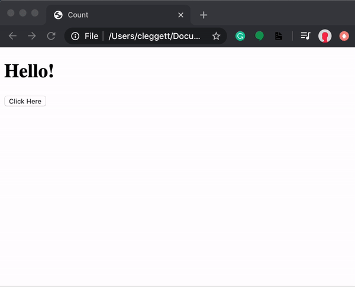{width="6.25in"
height="5.0625in"}

## [querySelector](https://cs50.harvard.edu/web/2020/notes/5/#queryselector)

In addition to allowing us to display messages through alerts,
JavaScript also allows us to change elements on the page. In order to do
this, we must first introduce a function called document.querySelector.
This function searches for and returns elements of the DOM. For example,
we would use:

let heading = document.querySelector(&apos;h1&apos;);

to extract a heading. Then, to manipulate the element we've recently
found, we can change its innerHTML property:

heading.innerHTML = &apos;Goodbye!&apos;;

Just as in Python, we can also take advantage
of [[conditions]{.underline}](https://www.w3schools.com/js/js_if_else.asp) in
JavaScript. For example, let's say rather than always changing our
header to Goodbye!, we wish to toggle back and forth
between Hello! and Goodbye!. Our page might then look something like the
one below. Notice that in JavaScript, we use === as a stronger
comparison between two items which also checks that the objects are of
the same type. We typically want to use === whenever possible.

&lt;!DOCTYPE html&gt;

&lt;html lang=&quot;en&quot;&gt;

&lt;head&gt;

&lt;title&gt;Count&lt;/title&gt;

&lt;script&gt;

function hello() {

const header = document.querySelector(&apos;h1&apos;);

if (header.innerHTML === &apos;Hello!&apos;) {

header.innerHTML = &apos;Goodbye!&apos;;

}

else {

header.innerHTML = &apos;Hello!&apos;;

}

}

&lt;/script&gt;

&lt;/head&gt;

&lt;body&gt;

&lt;h1&gt;Hello!&lt;/h1&gt;

&lt;button onclick=&quot;hello()&quot;&gt;Click Here&lt;/button&gt;

&lt;/body&gt;

&lt;/html&gt;

### HTML Elements

If you are sitting at a coffee shop next to a table of Web developers,
you will probably hear three words quite a bit: &quot;Tags&quot;, &quot;Attributes&quot;
and &quot;Elements&quot;.

&quot;Elements&quot; are the pieces themselves, i.e. a paragraph is an element,
a header is an element, even the body is an element. Most elements can
contain other elements, as the body element would contain header
elements, paragraph elements, in fact pretty much all of the visible
elements of the Document Object Model (that developers refer to as the
&quot;DOM&quot;).

As an example, let&apos;s look at a simplified version of the last HTML code
we showed you:

1.  &lt;!DOCTYPE html&gt;

2.  &lt;html lang=&quot;en&quot;&gt;

3.    &lt;head&gt;

4.     &lt;title&gt;Your first HTML page&lt;/title&gt;

5.     &lt;meta charset=&quot;utf-8&quot;/&gt;

6.    &lt;/head&gt;

7.    &lt;body&gt;

8.     &lt;h1&gt;My home page&lt;/h1&gt;

9.     &lt;p&gt;Hi! Welcome to my Home Page! My name is Michel Buffa, I&apos;m a
    professor at the University of Nice, in France, and I&apos;m also the
    author of two MOOCS about HTML5 on W3Cx.&lt;/p&gt;

10.    &lt;/body&gt;

11. &lt;/html&gt;

Click the red circle next to HTML to unfold this HTML document structure
(we can also say &quot;see its DOM structure&quot;):

Consider the figure above. It contains a single html element. It turns
out this includes within it the entire content of your html file. If you
click on the &quot;html&quot; red node, you&apos;ll find that it contains two
components, a head and a body. Clicking on each of those will reveal
their respective contents. This structure is what we computer scientists
call a &quot;tree&quot;. Any given element (except for the outermost &quot;html&quot;
element) is wholly contained inside another element, referred to as the
&quot;parent&quot; element. Not surprisingly, the elements contained within a
given element are its &quot;child&quot; elements. And, yes, children of a common
parent are often referred to as &quot;siblings&quot;.

Thus in the example above, the top element is the html element, which
contains just two elements, the head and body.  The head element
contains a title element and the body contains an h1 element and
a p element.  In a more typical example, the body would contain many
more children, but for our purpose this is enough. p is for
&quot;paragraph&quot; (the text between &lt;p&gt; and &lt;/p&gt; will be separated by
some space before the next element is displayed in the final HTML page
rendering), h1 means &quot;heading level 1&quot;, and will be rendered by
default in bold with a bigger char size than any other text element,
etc.

That may be a great picture, but how do we represent such a structure in
a text file?  Well, that&apos;s where &quot;tags&quot; come in.

#### Tags

{width="2.3333333333333335in"
height="2.3333333333333335in"}

# &lt;html&gt;

### &lt;BODY&gt;

#### &lt;p&gt;

##### &lt;em&gt;

&quot;Tags&quot; are what we use to organize a text file (which is just a long
string of characters) such that it represents a tree of elements that
make up the html document. Tags are not the elements themselves, rather
they&apos;re the bits of text you use to tell the computer where an element
begins and ends. When you &quot;mark up&quot; a document, you generally don&apos;t
want those extra notes that are not really part of the text to be
presented to the reader.

HTML borrows a technique from another language, SGML, to provide an easy
way for a computer to determine which parts are &quot;MarkUp&quot; and which
parts are the content. By using &quot;&lt;&quot; and &quot;&gt;&quot; as a kind of
parentheses, HTML can indicate the beginning and end of a tag, i.e. the
presence of &quot;&lt;&quot; tells the browser &quot;this next bit is markup, pay
attention&quot;.

Whatever that tag (or &quot;open tag&quot;) does, it applies to the content
following the tag. Unless you want that to be the entire rest of the
document, you need to indicate when to stop using that tag and do
something else, so &quot;&lt;&quot; and &quot;&gt;&quot; are used again. Since elements are
typically nested within other elements, the browser needs to be able to
distinguish between the end of the current tag and the beginning of a
new tag (representing a nested element). This is done by adding a &quot;/&quot;
right after the &quot;&lt;&quot; to indicated that it&apos;s a &quot;close tag&quot;. To
indicate the beginning and end of a paragraph (indicated by the single
letter &quot;p&quot;) you end up with something like this:

1.  &lt;p&gt;This is my first paragraph!&lt;/p&gt;

The browser sees the letters &quot;&lt;p&gt;&quot; and decides &quot;A new paragraph is
starting, I&apos;d better start a new line and maybe indent it&quot;. Then when
it sees &quot;&lt;/p&gt;&quot; it knows that the paragraph it was working on is
finished, so it should break the line there before going on to whatever
is next.

For example, the &quot;&lt;em&gt;&quot; tag is used for element that
needs **Em**phasis.  The  &quot;&lt;&quot; and &quot;&gt;&quot; indicate that this is a tag,
and the &quot;little bits of text&quot; in between tell us what kind of tag it
is.  To completely describe the element, it needs an open and close
tag, and everything in between the tags is the contents of the element:

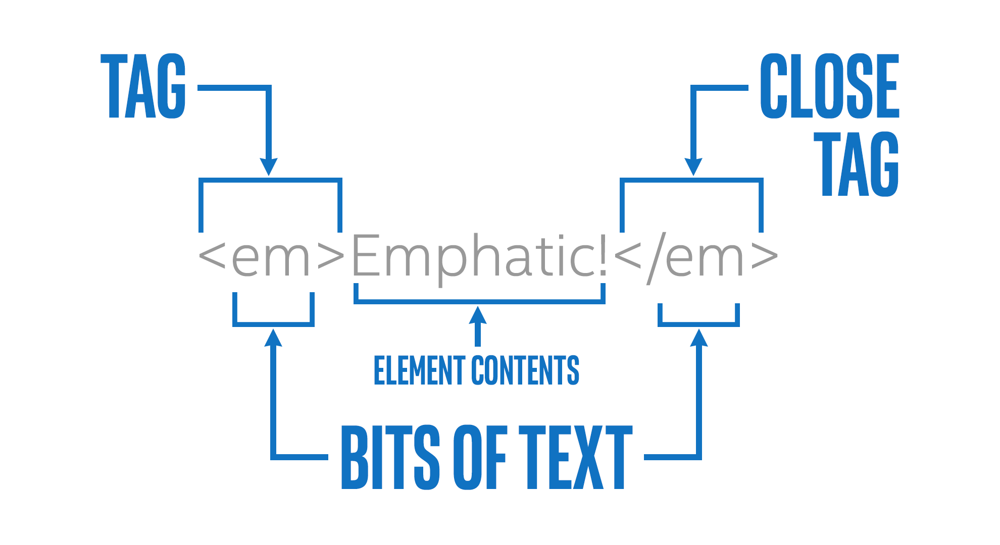{width="6.5in"
height="3.529166666666667in"}

Most tags have open and close versions, but there are a few strange
ones.  For more info, we strongly recommend that you follow the
W3Cx [[HTML5&CSS
Fundamentals]{.underline}](https://www.edx.org/course/html5-introduction-w3cx-html5-0x-0) course,
but we generally refer to the strange ones as &quot;self closing&quot; tags.  
Usually these tags represent an element that is completely described by
its attributes, and thus there is no need for other content.  So if you
see something like this:

1.  &lt;img src=&quot;https://goo.gl/pVxY0e&quot; alt=&quot;Floating Flower&quot;/&gt;

&hellip; then you should know that the slash at the end of the open tag is
sort of a shorthand for a close tag, so you won&apos;t see any other
indication that this element is now complete. There are also a few tags
that don&apos;t even use the &quot;/&quot; at the end, they just don&apos;t have any
close tag at all.  This works because all of the information this tag
needs is declared in an &quot;attribute&quot;.

The &lt;img&gt; tag is one of them, the &quot;/&quot; at the end is optional and can
be removed entirely, this will still be [[valid
HTML5]{.underline}](http://w3c.github.io/html/syntax.html#void-elements).

1.  &lt;img src=&quot;https://goo.gl/pVxY0e&quot; alt=&quot;Floating Flower&quot;&gt;

These elements, without a &quot;/&quot; at the end, are called &quot;void
elements&quot;. They are : area, base, br, col, embed, hr, img, input, link,
menuitem, meta, param, source, track, wbr.

#### Attributes

Most of what you can learn about HTML attributes is presented [[in the
three W3Cx MOOCs about
HTML5]{.underline}](https://www.edx.org/school/w3cx) (fundamentals,
coding essentials, and advanced techniques), but we can introduce the
idea briefly in this JavaScript course. Basically, a given element on
your Web page can be distinguished by any number of unique or common
attributes. For example, we&apos;ve already seen how an image can be
inserted in your Web page, and in that example we
used the width attribute of the &lt;img&gt; tag in order to constrain
the width of the image:

1.  &lt;img src=&quot;https://pbs.twimg.com/profile_images/110455194/n666194627_2302_400x400.jpg&quot;

2.       width=200 alt=&quot;Michel Buffa plays rock&roll&quot;&gt;

As you might guess, the &lt;img&gt; tag also has a height attribute, as well
as others. Different HTML tags share some common attributes that we&apos;ll
meet in the next section, which are particularly useful when coupled
with CSS (id and class) for applying graphic styles (color, shadow,
etc.), but  can also have specific attributes (for example:
the src attribute can be found in
the &lt;video&gt;, &lt;audio&gt;, &lt;img&gt; tags but not on a &lt;p&gt; or on
an &lt;h1&gt; tag!)

Try changing the value of the width attribute in the example below, or
add a height attribute, and see the result:

Hi!

In this video, I will show you how to create from scratch an HTML page
using some of the most common HTML tags.

So, I will use an online tool for doing that. Like that, you will see
some live preview of what I&apos;m doing.

So I&apos;m using &quot;jsbin.com&quot;, and I will work on the HTML part of the
editor,

and you will see in the output part the results of what I&apos;m doing.

So, JsBin created for me a first template.

So, most common HTML5 starts with &lt;!DOCTYPE html&gt;, that tells the
browser that the file is going

to render will be an HTML5 file.

Then, you&apos;ve got a first element that is called &lt;html&gt; and you&apos;ve
got the closing corresponding element that is &lt;/html&gt;.

It&apos;s a common way with markup languages to have opening and closing
tags.

And as you saw in the course, when you&apos;ve got such elements, they will
have children.

So in the HTML tag, we will have an head element and a body element.

So, we&apos;ve got a head element, here, and an empty body element, here.

In the &lt;head&gt;, usually, we specify the title: &quot;First HTML page&quot;.

And this title is what will be displayed when you put the cursor on a
tab in your browser.

Then, it is a good practice to indicate the language: &quot;lang=en&quot;
(English). Like that, you will be better indexed by search engines.

And then in the body of the document, we will add some really visible
content.

So, I start with the very common element, a very common tag.

The tag is the notation between &lt; and &gt; signs and the element is the
conceptual

thing - like, I'm writing a heading.

Ok, so &quot;This is my first page&quot;. This is a heading 1, and you&apos;ve got 6
levels for typing titles.

And also very common, is a paragraph: &lt;p&gt;, &lt;/p&gt;, I typed the opening
and closing tags.

And I enter &quot;this is a paragraph&quot;.

I write a subheading h2: &quot;My hobbies are:&quot;.

Ok, you see that the size of headings are different here.

And if, in the paragraph, if I go to the next line, this doesn&apos;t have
an effect here.

The only return to the next line I can do is, either write another
paragraph inside the paragraph,

or I can use also another tag that is useful just for going to the next
line without letting

some space between paragraphs, it&apos;s called &lt;br&gt;.

And &lt;br&gt; in that case, I can go to the next line.

If I want to enumerate my hobbies, a very common practice is to use
lists.

So in HTML, you&apos;ve got an unnumbered lists that are composed of list
items.

For example: &quot;I play guitar&quot;, &quot;I code video games&quot;. These are my
hobbies.

&quot;I like movies&quot;, etc.

If I want, instead of an unnumbered list, a numbered list, I can use an
order list.

With &lt;ol&gt; instead of &lt;ul&gt;.

In that case, you can see numbers.

Another very common element is the &quot;img&quot; tag that is useful for
inserting an image in your Web page.

The tag &quot;img /&quot; is a self-closing element, so you don&apos;t have an
opening tag and a closing tag.

And you will use different attributes for specifying the size of the
image.

For example, I want an image of 100 pixels width.

You can indicate a description of an image, and this is a good practice.

So I going to insert an picture of Leonardo Di Caprio in this example.

And you&apos;ve got other different attributes that will not be detailed
this time but I recommend you to follow the HTML5 intro. course

and the other course about HTML5 provided by the W3Cx.

So in order to indicate which image I want in this page, I need to use
the &quot;src&quot; attribute

that will take as a value the URL of the image.

So for this example, I&apos;m using the images.google.com for finding an
image of Leonardo.

I pick an image of Leonardo.

I display the image and i&apos;ve got the URL, here, in the address bar.

I just copy and past it and i&apos;ve got Leonardo Di Caprio in my document.

**[CSS is for Style]{.underline}**

Hi!

In this short video, I will show you quickly the principle of CSS.

I recommend you however to follow the CSS Basics course from W3Cx if you
want to learn this technology more deeply.

So HTML is for structure.

CSS is another language, by W3C, that it&apos;s useful for specifying the
look and feel of these elements.

How do they fit together...

How many spaces between them...

What color to use, and so on ...

So I&apos;m just going to copy and paste some examples here, and you saw
that the look and feel of the document changed.

And it&apos;s, now, using show shadows, borders, background colors,
different character fonts and so on.

So the CSS file, here, is just using what we call &quot;rules ».

A rule is a selector, so this means for all &quot;h1&quot; elements in the page,
I want to apply these properties.

And each property has a name 'color', and a value 'red'.

So, you indicate, for each different elements you selected (the &quot;h1&quot;,
the &quot;h2&quot;, the &quot;p&quot; the paragraph, for the image)

... you indicate what you want to change. For example, for the image in
the document, you indicate a shadow.

### Definition

{width="2.5in"
height="1.40625in"}CSS, or **C**ascading **S**tyle **S**heets, is a
style sheet language used to describe the way an HTML or XML document
should look to a user. CSS is where you specify the color, size,
spacing, font and other visual aspects of the content that you create in
your markup language document.

Usually you will see CSS used alongside HTML to describe the way a Web
page looks and feels. You can have a Web page without CSS, but it would
be very difficult to make it look the way you want with just HTML. This
is why almost every Web page is a combination of HTML and CSS.

**CSS** • /si-ɛs-ɛs/ • *noun *

> Stands for &quot;**C**ascading **S**tyle **S**heets&quot;. A style sheet
> language for describing how to display an HTML document.

#### Let&apos;s look at an example!

Let&apos;s take the (ridiculous) Michel Buffa home page again:

Notice the use of some HTML tags: h1, img, p, body etc.

Now, we can add some &quot;CSS rules&quot; to the HTML, and see that the
appearance of the resulting HTML page rendering is rather different
(click on the HMTL/CSS buttons to see alternatively the HTML or the CSS
code, remember you can always make changes to the code: change the color
in the CSS part, etc.):

If you click on the CSS button on the top left of the previous codepen
example, you will see the CSS rules that have been applied to the HTML
document. Let&apos;s look at the first one:

1.  h1 {

2.      color:red;

3.      background-color:lightGreen;

4.      border:12px solid violet;

5.      padding: 5px;   

6.      border-radius: 15px;

7.      text-align: center;

8.  }

This rule turns all the h1s in the document into red text, centered
horizontally, on a light green background, with a violet border of 12
pixels (a solid border, not a dashed one), and this border has rounded
corners made of arcs of a circle whose radius is 15 pixels.

The part before the opening brace (line 1) is the &quot;CSS selector&quot;, it
indicates the elements that will have their properties changed according
to what is inside the braces.

The part inside the braces is a set of properties and values that will
be useful for setting the look and feel of the selected elements.

Line 2 for example, says that all h1s will be colored in red.

#### CSS rules are applied in sequence

After the previous rule is applied, then the second rule is taken into
account, then the next, etc. In this way, you can see that all h2s will
be brown (second rule).

The third rule uses what is called &quot;a multiple selector&quot;:

1.  p, h1, h2 {

2.     font-family: cursive

3.  }

This one says that all p, h1 and h2 will use a cursive font character.
The &quot;,&quot; means &quot;and also&quot;.

This is also how we indicate in the last rule that images and paragraphs
should be moved to the right 50 pixels (property margin-left: 50px)

#### The id and class attributes

Basically, any given element on your Web page can be identified uniquely
with an &apos;id&apos; attribute, or grouped with a class of other elements by
setting the &apos;class&apos; attribute.

1.  &lt;p id=&quot;paragraph-1&quot; class=&quot;regular-paragraphs&quot;&gt;

2.      Call me Ishmael . . .

3.  &lt;/p&gt;

The paragraph above has a unique identifier: the id attribute whose
value is &quot;paragraph-1&quot; and is part of a class of
&quot;regular-paragraphs&quot;. The letters inside the quotes have no meaning to
the computer, they just need to be consistent. They are actually
strings. 

Again, the fact that the computer does not care what we put in those
strings (except for some restrictions) means we can use them to convey
meaning to a human developer. I could just as easily have
said id=&apos;x&apos; and class=&apos;y&apos;, but anyone looking at that would have no
hint what the significance of x and y are. Best practice is to name
these things to increase clarity, consistency and brevity.

Let&apos;s look at a modified version of the Michel Buffa&apos;s home page
example:

The last two rules first target the element whose id is &apos;hobbyTitle&apos;,
in our case it&apos;s the second h2 element:

1.  &lt;h2 **id=&quot;hobbyTitle&quot;**&gt;My Hobbies&lt;/h2&gt;

And here is the CSS rule:

1.  **#hobbyTitle** {

2.    font-family: &apos;caveat&apos;;

3.    font-size:40px;

4.    text-shadow: 4px 4px 2px rgba(150, 150, 150, 1);

5.  }

Line 1 uses the &quot;#&quot; character in the selector, meaning that we&apos;re
going to select an element by its id attribute. In this case, the
selector equal to #hobbyTitle, will select the element that has an
attribute id=&quot;hobbyTitle&quot;.

In that case we use a funny char font called &apos;caveat&apos; we took from the
Google font service
(see [[fonts.google.com]{.underline}](https://fonts.google.com/)), and
in order to be able to use it in a font-family CSS property, we included
its definition using a &lt;link&gt; tag in the HTML part of the document:

1.  &lt;head&gt;

2.    &lt;title&gt;Your first HTML page&lt;/title&gt;

3.    &lt;meta charset=&quot;utf-8&quot;/&gt;

4.    **&lt;link href=&quot;https://fonts.googleapis.com/css?family=Caveat&quot;**

5.  **        rel=&quot;stylesheet&quot;&gt;**

6.  &lt;/head&gt;

The last rule targets all elements that have an
attribute class=&quot;funny&quot;. Notice they can be different elements, we can
have a p and an h3 element that have the class=&quot;funny&quot; attribute:

1.  **.funny **{

2.    color:purple;

3.    font-family: &apos;caveat&apos;;

4.  font-size:40px;

5.  }

This rule will change the color, font family and size of two out of
three paragraphs in the HTML element:

1.  &hellip;

2.  &lt;p class=&quot;funny&quot;&gt;I also play electric guitar and love
    coding WebAudio applications&hellip;&lt;/p&gt;

3.  &hellip;

4.  &lt;p class=&quot;funny&quot;&gt;Music, Movies, Video Games, Traveling, Family, etc.&lt;/p&gt;

There are many, many, many different CSS properties in existence, and
many different ways to select elements. We recommend that you follow the
W3Cx [[CSS Basics and HTML5&CSS
Fundamentals]{.underline}](https://www.edx.org/school/w3cx) courses to
learn more about CSS and about HTML5 basics.

#### Where can we put the CSS rules: In the HTML file? In another file? 

You can do both! 

You can embed the CSS rules between a &lt;style&gt;&hellip;&lt;/style&gt; tag,
located inside the &lt;head&gt;&hellip;&lt;/head&gt; of the HTML documents, like in
this example:

This is OK if you do not have too many CSS rules. In general it&apos;s
better to put the CSS rules in one or more separate .css files, like
this ([[open this example in
Plunker]{.underline}](https://plnkr.co/edit/vedmaDmnfiJzoiLPrInG?p=preview))

{width="6.5in" height="2.3125in"}

Note that when you use an online IDE, you usually type/paste the CSS
rules in a &quot;CSS tab&quot; in the online editor, and it will hide all the
plumbery for you (except the more complete ones such
as [[plunker]{.underline}](https://plnkr.co/) or [[c9.io]{.underline}](https://c9.io/) that
will enable you to manage files in the cloud).

### Live coding video: mixing HTML and CSS

In this video, I will show you how you can include CSS in your HTML
file, because we used

online tools that hide, in a way, the location of the different
languages.

So, if you take this example we described in the previous video,

and if I export it using CodePen...

and if I look at the zip file that has been dowloaded,

you can see CSS file are located in the subdirectory and in a .css file.

This is a common way for organizing source code when you make a project
with HTML and CSS.

And if we open the &quot;index.html&quot; file, you can see that, what is really
going on if we look at the source code.

Actually, in order to include CSS file in an HTML file, we use the
&quot;link&quot; tag with the attribute

&quot;rel = &quot;stylesheet&quot; and &quot;href&quot; = the name of the file.

So here, it means the &quot;style.css&quot; file located in the &quot;css&quot;
subdirectory.

So if I open this project with Sublime Text ...

I go to the directory I&apos;ve just downloaded, and if I open the
directory, I can see my hierarchy, here.

The &quot;index.html&quot; file that includes the .css file.

And if I open the &quot;style.css&quot;.

I can see the CSS content here. And it&apos;s interesting to use a real
source code editor because you&apos;ve

got auto-completion on the name of the properties: « background-color&quot;.

You can use also some wizard for indicating or choosing the colors.

So if I take this color, it will give me directly the value and so on.

So you can edit your CSS, edit your HTML and when you save the result,
you can open directly

in your browser the file and see the result.

Here, I change the background-color of the heading 1.

You can also used directly in your HTML, the CSS rules.

In that case, instead of using the &quot;link&quot; element, you use the
&quot;style&quot; element.

&lt;style&gt;, &lt;/style&gt;, and like that you can directly include, in the
HTML file, the style.

So I&apos;ve got &quot;h1&quot; CSS rule, that will indicate how the &quot;h1&quot; will be
rendered and I&apos;m no more including an external file.

If I save this and &quot;Open in the Browser&quot;, I&apos;ve go the same result
here for the &quot;h1&quot;.

And if I look at the source code, I will see directly in the HTML, the
CSS rule.

So, to sum up, you can have your CSS in external file or inside the HTML
file using the &quot;style&quot; element.

[JavaScript is the Interactive Glue]{.underline}

### Live coding video: JavaScript is the interactive glue between HTML and CSS

Hello, your Web browser can only understand three different languages
when you ask for

a Web page to be rendered in the browser.

So, let&apos;s take this document for example.

We type the URL here, and the document arrives from a remote machine.

And this document is a HTML source code that has been interpreted and
rendered to give

you a nice looking document.

In this HTML, you can have CSS rules for specifying the look and feel of
the document

as we saw in the previous example.

But, you can also have Javascript code and Javascript when its run
inside the browser

can act as a glue between HTML and CSS.

We will use Javascript to provide interactivity to the documents.

In this example, the first one on this page, I can click to change the
content of the document.

So we modify what we call the document object model.

It&apos;s exactly the set of elements that compose the page.

When I click, I change the content of the heading.

That was previously equal to 'My home page', and then when I clicked on
the button,

(this is an HTML button), this is how in Javascript we can indicate

that we are going to do something when you click on it.

In that case, it means call the function named &quot;changeTitle&quot; and the
function is here defined

between &lt;script&gt; and &lt;/script&gt; elements.

In this example, the Javascript lies inside the HTML file and the
function is a piece

of code that can be run on different conditions.

A click on the button executes these two lines of code here.

So, 1st use: interact with the document object model, interact with the
HTML elements of the page,

add new ones, modify some existing ones, remove some elements.

It can be also use for interactive for the CSS styles of the page.

So, in this example, I click on the button. And instead of modifying the
content of the page,

I just change the look and feel.

I change the CSS style of the heading.

If we look at the code quickly without going into details: when I click
on the button

&quot;button onclick&quot;, I call the &quot;changeTitleCSSStyle&quot; function.

In this function will use the &quot;style&quot; attribute of some elements that
correspond to the heading 1

and it will indicate that we want the text to be black, the background
color to be

yellow and the border to be 5 px wide, dashed and colored in red.

This was just an example. What we can do with Javascript goes much
further than this simple example.

We can work with remote data, upload and download data from a remote
server.

We can use it for making multimedia players, for writing video games,
for making music,

for building tables on the fly to display some dynamic data that you
came after, for

example, we enter some text in the search form, etc.

During week 1, we will see other examples with different sort of
applications of JavaScript.

And, we will first give some explanations about variables, functions,
some basics events handling:

how to detect a click? how to debug the code?

What tools we're going to uses for writing Javascript code, and so on.

### JavaScript is the interactive glue between HTML and CSS

JavaScript is the third of the &quot;magic trio&quot;: HTML5/CSS/JavaScript. It
is the only programming language a browser can run (without installing
any plugins or extensions), and it&apos;s a real standard of the Web (even
if not standardized by the W3C).

#### Why do we call it &quot;the interactive glue between HTML and CSS&quot;? 

{width="2.6041666666666665in"
height="2.2291666666666665in"}

Actually, this description does not do justice to JavaScript, which can
do far more than just act as glue. JavaScript can be run outside of the
browser (on a nodeJS interpreter on a remote server, or in scripts run
by the operating system), but for this intro course, we will focus on
&quot;JavaScript&quot; in the browser (an advanced course about &quot;server side
JavaScript&quot; is on its way at W3Cx).

So, in the browser, JavaScript lies between HTML and CSS and will be
used together with these two languages. Let&apos;s take a look at two small
examples:

##### Example 1: Push the button to modify the heading of the page.

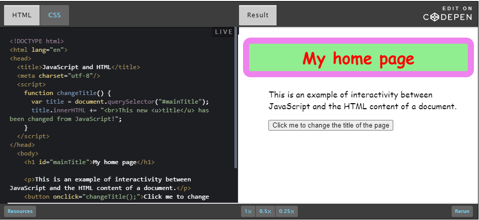{width="6.5in" height="2.98125in"}

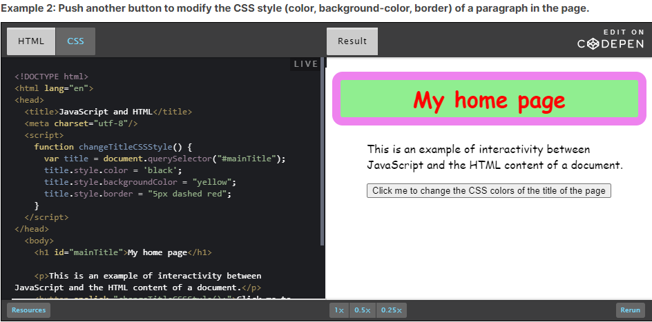{width="6.5in"
height="3.2152777777777777in"}

We will take a detailed look at how these examples work in the
subsequent parts of the course. These examples are just here to show you
how JavaScript can interact with the HTML content and the CSS styles of
a Web document.

Notice that in these examples, the JavaScript code is located in the
HTML of the document.

**[History of JavaScript]{.underline}**

JavaScript was born in 1995 as part of the work of Brendan Eich&apos;s team
at [[Netscape]{.underline}](https://en.wikipedia.org/wiki/Netscape) (the
ancestor of [[Mozilla]{.underline}](https://www.mozilla.org/)). At that
time, Netscape, in association with Sun MicroSystems, provided popular
server and client-oriented solutions ([[Netscape
Navigator]{.underline}](https://en.wikipedia.org/wiki/Netscape_Navigator),
ancestor
of [[Firefox]{.underline}](https://en.wikipedia.org/wiki/Firefox)) which
depended on Java. (Sun Microsystems,  the company that created the Java
programming language, no longer exists, having been bought by Oracle
Corporation in 2009.)

{width="1.7291666666666667in"
height="0.7604166666666666in"}

But Netscape realized that Java wasn&apos;t a suitable language for
in-browser use. Netscape thought of JavaScript at the beginning, as a
lightweight Java.

JavaScript was initially inspired by Java, but in fact only some naming
conventions remained the same. We highly recommend not even trying to
look for similarities - this is actually a bad way to start learning
JavaScript! We&apos;d rather just say that the only real commonality between
these two languages is their names. If you are coming to this
course from Java, leave the Java thinking behind!

JavaScript quickly became a success following its first
appearance in [[Netscape Navigator 2 in March
1996]{.underline}](http://cybernetnews.com/cybernotes-history-of-web-browsers-opera-netscape-firefox-and-ie/), and
it was quickly integrated into other popular browsers. Microsoft also
created its own version named JScript (and shipped it with Internet
Explorer 3 in 1996).

{width="5.666666666666667in"
height="4.3125in"}

**Netscape Navigator 2 in 1996, with big buttons and plain HTML pages
(CSS did not exist at that time)**

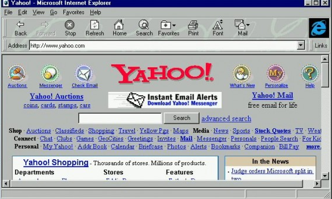{width="5.895833333333333in"
height="3.5416666666666665in"}

**Internet Explorer 3 in 1996 - look at the official Yahoo page :-) CSS
did not exist at this time!**

{width="1.5520833333333333in"
height="0.6458333333333334in"}Towards the end of 1996, JavaScript was
standardized
by [[ECMA]{.underline}](https://en.wikipedia.org/wiki/Ecma_International) as
the [[EcmaScript]{.underline}](https://en.wikipedia.org/wiki/ECMAScript) standard. **So
no matter whether you see it called JavaScript or EcmaScript, don&apos;t
worry, it&apos;s the same thing.** EcmaScript has continued to be released
right up to the present day.

#### THE PRESENT: what is the current version? What about ES6/ES2015/ES2016 I saw on the Web, are these the new names of JavaScript?

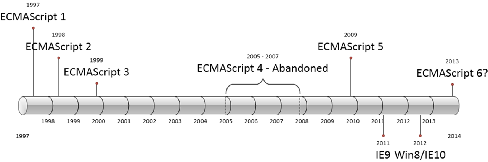{width="6.5in"
height="2.16875in"}

Since 1996, multiple versions of JavaScript have appeared. The stable
version with 99% of features supported by all major browsers deployed on
computers and smartphones is EcmaScript version 5 from 2010, but the
latest official version is version 6, also called ES2015 or ES6. A 7th
version is on its way (called ES2016, ES2016+, ES7, JavaScript 7&hellip;).

ES2015 is a pseudonym for the latest version of the JavaScript
programming language to be approved by ECMA International, the standards
group responsible for vetting and approving different versions of the
language. In June 2015, ECMA International [[approved the 6th edition of
the
language]{.underline}](http://www.ecma-international.org/publications/files/ECMA-ST/Ecma-262.pdf).
The name, ES2015, is used because the latest version of JavaScript is
identified as the 2015 version of ECMAScript (the alternative name for
JavaScript). [[Read this blog post about all these naming
incongruities!]{.underline}](http://benmccormick.org/2015/09/14/es5-es6-es2016-es-next-whats-going-on-with-javascript-versioning/)

Up until relatively recently, ES2015 was referred to as ES6 and before
that, Harmony. Moving forward, ES suffixed with the year of the latest
approved standard is the naming convention. The next version should be
standardized soon, and it&apos;s called&hellip; ES2016 or ES2016+! Browser
vendors do not wait until ECMA standardizes a version, they start
implementing it during the standardization process, which can take
months or years (they also contribute to the standardization process all
along its life cycle).

**Beware**: even on recent Web browsers, ES2015 and ES2016 have
supported feature sets are not completely implemented!

##### Current support for ES2015/ES6/JavaScript 6th version (January 2017):

{width="6.5in" height="1.10625in"}

As you can see, recent browsers usually support more than 90% of
ES2015/JavaScript 6 features.

##### Current support for ES2016/JavaScript 7th version (January 2017):

{width="6.5in"
height="1.0416666666666667in"}

Well, ES2016, the 7th version of JavaScript is not yet
officially standardized, and its support, even by latest browser
versions (with the exception of Firefox) is rather weak.

#### Which version will we learn?

First of all, this is an intro course! Not all features of JavaScript
need to be covered, in particular the ones that you cannot run in your
browser without using advanced tools (there are tools, such
as [[Babel]{.underline}](https://babeljs.io/),  that can turn ES2016
source code into ES5 code that can be run in nearly any browser, but
they are tricky to use and not for beginners).

**We will cover all the important features of ES5 and ES2015**. From
time to time we might say &quot;in ES5 you would do this, but ES2015 also
supports this syntax, which is simpler, more powerful, etc.&quot;, and we
will, of course, provide examples.

#### Is JavaScript an important language to learn? What about Java, PHP, C#, Python, Ruby and all the others?

JavaScript is the only programming language you can run in your browser.
Without JavaScript there would be no games, no fancy dynamic HTML forms,
no interactive maps, no Gmail, no YouTube, no Twitch TV, no Netflix&hellip;.

JavaScript is integrated into nearly every popular Web browser and is
probably the most frequently used language in the world. More than 90%
of Web documents now use JavaScript too.

Every computer, smartphone, and tablet uses JavaScript many times a day
within the browser and even as native code! Indeed, some applications
are compiled from their JavaScript/HTML/CSS version into &quot;classic&quot;
applications that can be run without a browser. This compilation step
can give an extra performance boost, the NetFlix application, or Office
365 are such applications.

In the beginning, JavaScript was invented to work not only on the client
side (in Web browsers) but also on the server side (on the Netscape HTTP
Web server back in 1995).

In recent years this trend has returned, thanks to the appearance of the
Node.js server/JavaScript interpreter. It&apos;s common to see JavaScript
applications running on a remote Web server. This particular use of
JavaScript will be covered by another course that will be proposed by
W3Cx, but mastering JavaScript basics is highly recommended before
trying to learn JavaScript server side programming.

#### JavaScript is an interpreted language

JavaScript is an interpreted (or just-in-time compiled) language, which
means that the code is converted into a machine language at, or just
before, runtime. The most popular JavaScript engines are:

-   [[SpiderMonkey]{.underline}](https://developer.mozilla.org/fr/docs/SpiderMonkey) (included
    > in Mozilla Firefox)

-   [[JavaScriptCore]{.underline}](https://developer.apple.com/reference/javascriptcore) (included
    > in Apple Safari)

-   [[Chrome
    > V8]{.underline}](https://developers.google.com/v8/) (included in
    > Google Chrome, in the Node.js server)

-   [[Chakra]{.underline}](https://github.com/Microsoft/ChakraCore) (included
    > in Microsoft Internet Explorer and now in the Microsoft Edge
    > browser)

**[The Best Way to Learn JavaScript]{.underline}**

So, what it the best method for learning JavaScript?

When you are a complete beginner, I will recommend to look at examples,
tweak them, change small things, try to understand how the syntax looks
like.

Even without deep explanations, without reading a book, or studying in
details

the different concepts of language, you can learn a lot.

So, in this section, I propose that you look at a small example without
understanding the details, and try to tweak it.

So here is the example we provide.

It&apos;s just an example that draws, that plots, a mathematical function.

So you can use the mouse wheel to zoom in, zoom out, and you can look at
the HTML code.

There is only very few CSS and very few lines of JavaScript.

So how can we do the such a complex result?

Complex thing drawing the grid with axes, with labels, with a curve, and
interact with the mouse.

With only 10 lines of code: it&apos;s because we are using what we call an
external JavaScript library.

Actually, we are using 2 of them here.

Because, this one: the &quot;function-plot&quot; JavaScript library, is using
internally another one you must include also in the document.

So, what I propose is that we will start looking at this example.

The best way is to click on &quot;Edit on CodePen&quot; label here, it will open
the code in the CodePen.io online editor. And&hellip; just look at the HTML
part here.

Okay, we can just look at the HTML part and zoom in a little bit.

What do we see?

We can see that it uses 2 libraries here between &lt;script&gt; and
&lt;/script&gt; elements.

This is how we can insert in the document an external JavaScript file.

In that case, it&apos;s a remote JavaScript file because we are downloading
it using http.

So it uses this &quot;d3js&quot; JavaScript library that is located at
&quot;d3js.org&quot;.

You can open this in another tab and you will see the documentation and
the Web site, the homepage of the Web site, for the &quot;d3js&quot; library.

By the way &quot;d3js&quot;is one of the most popular JavaScript library for
visualizing data.

So let&apos;s go back to our example, so you can just tweak the different
elements.

If I want to plot a cosinus instead of a sinus, I don't need to
understand the whole

syntax here, but I guess that by just typing &quot;cos&quot; here, it will do
something.

And indeed I have just drawn a cosinus.

If I change this for &quot;green&quot;, it changes the color.

If I change the grid, that is by default &quot;true&quot;, if I say &quot;false&quot;, I
don&apos;t have a grid anymore.

Okay let&apos;s put it back. And I&apos;ve got some &quot;xAxis&quot; domain : &quot;-1,
+1&quot;.

If I change that for &quot;-10, +10&quot;, I can see the result.

So it&apos;s more interesting, if you change this for the x values&hellip;
instead of going from PI to 2 PI.

I went from 0 to 10 PI.

So I can see the result here, and so on&hellip;

So now that you tweak the example, you can try to understand what is
going on.

Okay, this thing is a name followed by a parenthesis. An open
parenthesis with a closing parenthesis. It&apos;s a function call.

When you&apos;ve got something like that, in JavaScript, function
parenthesis with something in the middle, it&apos;s called a &quot;function
call&quot;.

We&apos;re going to call a function, that, in this case, we haven't written,
so it&apos;s coming from one on the external libraries.

In that case, it&apos;s the &quot;function-plot&quot; library.

What is inside? There are the parameters.

And I can use an external name.

I can declare that, here, it&apos;s equivalent.

You see that it works the same here, but I've just separated the two
things.

If I put directly this thing inside here, like it was before, it still
works.

Okay, so what is this syntax?

In JavaScript, when you've got braces like that, opening braces and
closing braces,

it's called an object.

And inside an object, you&apos;ve got properties and values.

The properties have names: target, data, function, color, grid.

And the values are after a column characters.

The target is my function.

The data is this thing.

The grid is true, and so on&hellip;

So you separate the different properties of the object using a comma

and sometimes, you can have some properties that in turn, have a value
that is an object.

So the xAxis property is equal to an object that has a property domain,

that has for values: &quot;-1, 1&quot;.

And when you&apos;ve got brackets, opening and closing brackets, it&apos;s like
that&hellip;

That will define arrays of things in JavaScript.

And an array of things is a list of enumerable elements.

So in that case, the domain has two elements: the minimum value and the
maximum value.

And here you can see that the data that are plotted, the cosinus
function,

is also an array.

So, if I use the comma and I introduce a second element here.

For example, the sinus function, and if I change the color, let&apos;s make
it pink&hellip; Look at the result:

I&apos;ve got 2 different functions that have been plotted in my graph.

So I can, instead of using this, I can maybe plot x2 (x square 2), like
this, okay.

It should work. Ok, we can see a little bit of it here.

So maybe we will change the domain, so instead of stopping at 1, we go
to 10.

Here we go!

And if we look at the values, we see the x square function that is a bit
better,

and if we just plot it for x=0 to x=2&hellip;

&hellip;In that case, i&apos;ve got another scale for looking at the functions.

So, in this first example, you saw how to use an external library, what
is the syntax to call a function, and how we can define objects in
JavaScript by using a set of properties and values, separated by a
comma.

And we also had a first encounter with what we call arrays, that are
elements separated by commas inside brackets.

### **[What is the best method to learn JavaScript?]{.underline}**

#### FIRST: learn by looking at and tweaking the code in the examples

Well, there is no definitive answer to this question, but I&apos;d recommend
firstly looking at small examples, tweaking them and trying to guess
what they do. You will rapidly discover that you can learn a lot just by
modifying a few lines of JavaScript code, even if you do not understand
the whole thing. 

During module 1, we will give you some basics:

-   How to write a simple HTML/CSS/JS page,

-   Suggest some regular source code editors to use,

-   How to use online environments that run in the browser, and offer an
    > &quot;instant preview&quot; of your creations. These tools are generally
    > not suited for full scale projects, but are really valuable for
    > testing and learning.

-   We will present many examples (some short and some bigger ones) that
    > will show what can be done with JavaScript. We strongly encourage
    > you to tweak them, look at the code, download them on your hard
    > disk, etc. Even if you do not understand everything, have a go
    > at modifying them; further down this page we outline such an
    > exercise.

-   Over the coming weeks we will be revisiting the examples,
    > and discussing them in greater detail and with fuller
    > explanations.

#### SECOND: take some time to carefully read the sections titled &quot;What you&apos;ve learnt / let&apos;s detail &hellip;.&quot;

During the course, we will provide extra &quot;reference pages&quot; that
will detail some important parts of the language. For example, in a
later section this week we will explain the concepts of &quot;variables&quot;,
&quot;values&quot;, &quot;operators&quot;, &quot;output&quot;, etc.

### Here is an example - we provide some clues, but it&apos;s your job to tweak it!

Here is an example that uses an external JavaScript library useful for
plotting math functions. Look at the JavaScript code (click on the JS
button) and try to guess where the function is specified, where the
range for the x and y values is set, etc. Notice that you can use your
mouse wheel to zoom in/out the function plot.

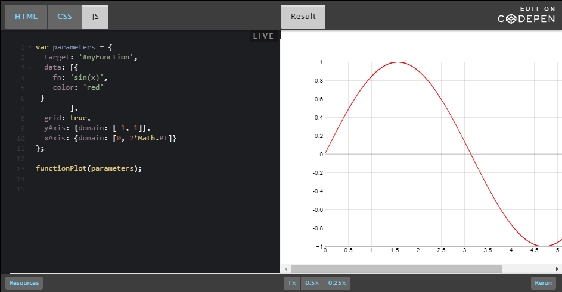{width="6.5in"
height="3.3847222222222224in"}

By looking at this example (HTML and JS code), you will notice a few
things:

Two lines in the HTML code that correspond to the inclusion in the
document of some external JavaScript code:

> &lt;script src=&quot;https://d3js.org/d3.v3.min.js&quot;&gt;&lt;/script&gt;
>
> &lt;script src=&quot;https://mauriciopoppe.github.io/function-plot/js/function-plot.js&quot;&gt;&lt;/script&gt;

We will examine this soon in a later section of the course, but, in
brief, it means that we will use the d3js plotting library that is
apparently located
at [[https://d3js.org]{.underline}](https://d3js.org/) (try to visit the
site), and another from github (a famous repository for open source
contributions), and located in the github account of a person named
&quot;mauriciopoppe&quot;, the repository is named &quot;function plot&quot;. A rapid
search will give [[this
URL]{.underline}](http://mauriciopoppe.github.io/function-plot/) as the
home page of the &quot;function plot JavaScript library&quot;.

Then, looking at the JavaScript code of the example (click the JS button
on the CodePen example), we see:

> functionPlot(**{**
>
> **       target: &apos;#myFunction&apos;,**
>
> **       data: &lbrack;{**
>
> **       fn: &apos;sin(x)&apos;,**
>
> **       color: &apos;red&apos;**
>
> **    }&rbrack;,**
>
> **    grid: true,**
>
> **    yAxis: {domain: &lbrack;-1, 1&rbrack;},**
>
> **    xAxis: {domain: &lbrack;0, 2&ast;*Math.PI&rbrack;}**
>
> **}**);

Ok, the syntax looks strange if you are not used to JavaScript, but I
bet that you guessed that the function plotted is &quot;sin(x)&quot;, that the
color of the curve is &quot;red&quot;, that the range of the x values is &lbrack;0,
2&ast;*PI&rbrack;, and the range of the y values is &lbrack;-1, 1&rbrack;.

**Your job:**

1.  try to plot sin(x&ast;^2),

2.  try to change the domain for the x and y values,

3.  try to change the color of the curve, etc.

To do this:

-   Edit directly the JS code in the embedded example, after a
    > few seconds, you should see the updated result in the &quot;Results&quot;
    > tab,

-   &hellip;or just click on the &quot;Edit on CodePen&quot; title on the top
    > right of the embedded example, then change  the code. Normally you
    > should see the results of your modifications as soon as you stop
    > typing (we call this &quot;live coding&quot;). (Here is [[an example of
    > what you can
    > obtain]{.underline}](http://codepen.io/w3devcampus/pen/dvpEPZ) as
    > a result).

**What can you guess from this example?**

**[A function call]{.underline}**

You can think of this code in this way:

> functionPlot(&hellip;);

Where the &quot;&hellip;&quot; corresponds to some sort of parameter. When you see a
name followed by two parentheses (maybe with something in between)
followed by a &quot;;&quot;, this is &quot;**a function call**&quot;. 

*A function* is a piece of code defined somewhere else, that can
accept *parameters* (the &quot;thing&quot; between the parentheses), and that
will do something. In our case the function&apos;s name is &quot;functionPlot&quot;
and we can assume (or we read the documentation of the library) that
the goal of this function is to plot a mathematical function, as its
name tells us.

**Function parameters**

The &quot;thing&quot; between parentheses is what we call &quot;the parameters of
the function&quot;: the data we pass to the function so that it can plot
different math functions, with different colors, with different ranges
for the x and y values, with or without a grid, etc.

Let&apos;s have a look at the parameters we used in our example (the ones
you tweaked). They are in bold in the source code we saw earlier:

> {
>
>     **target**: &apos;#myFunction&apos;,
>
>     **data**: &lbrack;{
>
>              fn: &apos;sin(x)&apos;,
>
>              color: &apos;red&apos;
>
>           }&rbrack;,
>
>     **grid**: true,
>
>     **yAxis**: {
>
>          domain: &lbrack;-1, 1&rbrack;
>
>     },
>
>     **xAxis**: {
>
>          domain: &lbrack;0, 2&ast;*Math.PI&rbrack;
>
>     }
>
> }

**[JavaScript object]{.underline}**

In JavaScript you can have simple values like: 2, 5, &quot;hello&quot;,
&quot;3.14&quot;, and you may also encounter more &quot;structured&quot; values that we
call &quot;objects&quot;. In week 3 we will address JavaScript objects, but for
the moment we will just present them through examples, without too much
detail.

A JavaScript object can be defined by two braces with a set of
properties/values inside, separated by a comma. Here is a simple object:

> {
>
>    givenName: &quot;Michel&quot;,
>
>    familyName: &quot;Buffa&quot;
>
> }

We use the &quot;:&quot; separator between the property name and its value. We
use a comma between two properties, and we omit the comma after the last
property (or before the ending brace).

In our examples, the properties of the object that is passed as a
parameter to the functionPlot(&hellip;) call are in bold.

They are respectively:

-   **target**: the CSS selector that corresponds to the HTML element
    > that will contain the plot. Look at the HTML code (&lt;div
    > id=&quot;**myFunction**&quot;&gt;&lt;/div&gt;), the id value corresponds
    > to target: &quot;#**myFunction**&quot; in the object.

-   **data**: this is where we indicate the value of the function(s) to
    > be plotted. We talk about this in greater detail
    > below.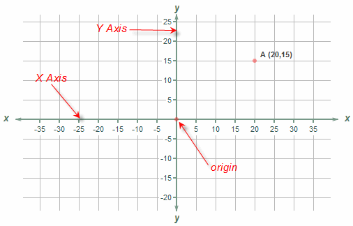{width="3.125in"
    > height="2.0in"}

-   **grid**: this can be true or false (we call these &quot;boolean
    > values&quot;) and indicates whether or not we want a grid to be drawn
    > in the background.

-   **xAxis**: the value specifies the domain (range) for the x
    > values&hellip;

-   **yAxis**: the value specifies the domain (range) for the y
    > values&hellip;

Notice that after each property (color, grid, etc.) there is a &quot;,&quot;.
Notice that between the name of the properties and the value there is a
&quot;:&quot;, etc&hellip;

**Embedded objects**

If we look at the values of the xAxis and yAxis properties, they
are also objects.

> xAxis: {
>
>     domain: &lbrack;0, 2&ast;*Math.PI&rbrack;
>
> }

The data object is even more complicated:

> data: &lbrack;{
>
>    fn: &apos;sin(x)&apos;,
>
>    color: &apos;red&apos;
>
> }&rbrack;,

Instead of containing another object like xAxis or yAxis, it contains
another sort of object, but inside brackets! **In JavaScript, brackets
are used to create *arrays*** of &quot;things&quot; (multiple, enumerable
things). In this example, the array contains one single object that has
two properties:

-   fn: the value of the function to be plotted, in this case sin(x),

-   color: the color of the curve

**In arrays, the different elements are separated by commas.** Let&apos;s
try to plot an additional function in our example. We will add f(x) =
cos(x) to our example, with a different color:

> data: &lbrack;
>
>     {
>
>        fn: &apos;sin(x)&apos;,  // First function
>
>        color: &apos;red&apos;
>
>     },
>
>     {
>
>        fn: &apos;cos(x)&apos;,  // second function
>
>        color: &apos;blue&apos;
>
>     }
>
> &rbrack;

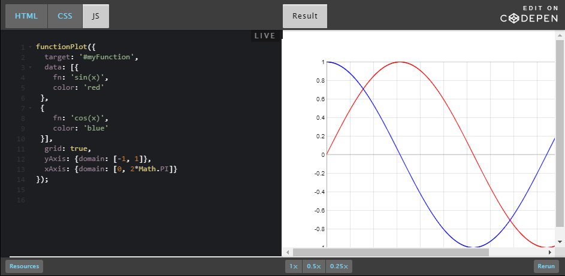{width="6.5in"
height="3.1777777777777776in"}

#### Conclusion

Just by looking at one example, and without going into the boring
details, you saw:

-   How to plot a function using a third party library and how to
    > include it in your code,

-   How to change some parameters without knowing JavaScript in depth,

-   You had a first encounter with concepts such as: &quot;a function
    > call&quot;, &quot;function parameters&quot;, simple objects, embedded objects
    > and arrays (we will discuss them as we move through the course,
    > beginning in week 1 - as you will see very soon!).

Not bad ;-)

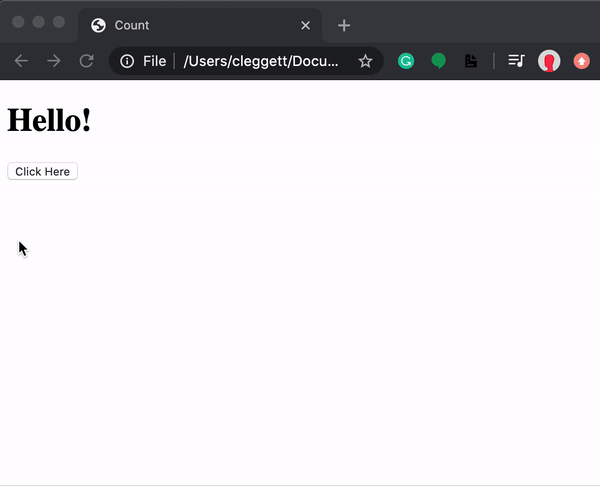{width="6.25in" height="5.0625in"}

## [[DOM Manipulation]{.underline}](https://cs50.harvard.edu/web/2020/notes/5/#dom-manipulation)

Let's use this idea of DOM manipulation to improve our counter page:

&lt;!DOCTYPE html&gt;

&lt;html lang=&quot;en&quot;&gt;

&lt;head&gt;

&lt;title&gt;Count&lt;/title&gt;

&lt;script&gt;

let counter = 0;

function count() {

counter++;

document.querySelector(&apos;h1&apos;).innerHTML = counter;

}

&lt;/script&gt;

&lt;/head&gt;

&lt;body&gt;

&lt;h1&gt;0&lt;/h1&gt;

&lt;button onclick=&quot;count()&quot;&gt;Count&lt;/button&gt;

&lt;/body&gt;

&lt;/html&gt;

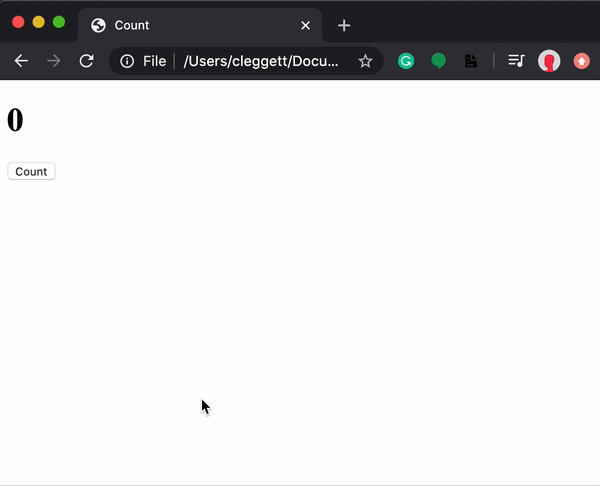{width="6.25in" height="5.0625in"}

We can make this page even more interesting by displaying an alert every
time the counter gets to a multiple of ten. In this alert, we'll want to
format a string to customize the message, which in JavaScript we can do
using [[template
literals]{.underline}](https://developer.mozilla.org/en-US/docs/Web/JavaScript/Reference/Template_literals).
Template literals requre that there are backticks (&ast;`) around the entire
expression and a &ast;$ and curly braces around any substitutions. For
example, let's change our count function

function count() {

counter++;

document.querySelector(&apos;h1&apos;).innerHTML = counter;

if (counter % 10 === 0) {

alert(&ast;`Count is now &ast;${counter}&ast;`)

}

}

{width="6.25in"
height="5.0625in"}

Now, let's look at some ways in which we can improve the design of this
page. First, just as we try to avoid in-line styling with CSS, we want
to avoid in-line JavaScript as much as possible. We can do this in our
counter example by adding a line of script that changes
the onclick attribute of a button on the page, and removing
the onclick attribute from within the button tag.

document.querySelector(&apos;button&apos;).onclick = count;

One thing to notice about what we've just done is that we're not calling
the count function by adding parentheses afterward, but instead just
naming the function. This specifies that we only wish to call this
function when the button is clicked. This works because, like Python,
JavaScript supports functional programming, so functions can be treated
as values themselves.

The above change alone is not enough though, as we can see by inspecting
the page and looking at our browser's console:

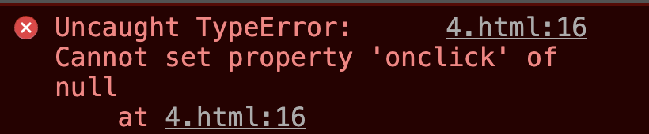{width="6.5in"
height="1.3472222222222223in"}

This error came up because when JavaScript searched for an element
using document.querySelector(&apos;button&apos;), it didn't find anything. This
is because it takes a small bit of time for the page to load, and our
JavaScript code ran before the button had been rendered. To account for
this, we can specify that code will run only after the page has loaded
using
the [[addEventListener]{.underline}](https://www.w3schools.com/jsref/met_document_addeventlistener.asp) function.
This function takes in two arguments:

1.  An event to listen for (eg: &apos;click&apos;)

2.  A function to run when the event is detected (eg: hello from above)

We can use the function to only run the code once all content has
loaded:

document.addEventListener(&apos;DOMContentLoaded&apos;, function() {

// Some code here

});

In the example above, we've used
an [[anonymous]{.underline}](https://www.w3schools.com/js/js_function_definition.asp) function,
which is a function that is never given a name. Putting all of this
together, our JavaScript now looks like this:

let counter = 0;

function count() {

counter++;

document.querySelector(&apos;h1&apos;).innerHTML = counter;

if (counter % 10 === 0) {

alert(&ast;`Count is now &ast;${counter}&ast;`)

}

}

document.addEventListener(&apos;DOMContentLoaded&apos;, function() {

document.querySelector(&apos;button&apos;).onclick = count;

});

Another way that we can improve our design is by moving our JavaScript
into a separate file. The way we do this is very similar to how we put
our CSS in a separate file for styling:

1.  Write all of your JavaScript code in a separate file ending in .js,
    maybe index.js.

2.  Add a src attribute to the &lt;script&gt; tag that points to this new
    file.

For our counter page, we could have a file called counter.html that
looks like this:

&lt;!DOCTYPE html&gt;

&lt;html lang=&quot;en&quot;&gt;

&lt;head&gt;

&lt;title&gt;Count&lt;/title&gt;

&lt;script src=&quot;counter.js&quot;&gt;&lt;/script&gt;

&lt;/head&gt;

&lt;body&gt;

&lt;h1&gt;0&lt;/h1&gt;

&lt;button&gt;Count&lt;/button&gt;

&lt;/body&gt;

&lt;/html&gt;

And a file called counter.js that looks like this:

let counter = 0;

function count() {

counter++;

document.querySelector(&apos;h1&apos;).innerHTML = counter;

if (counter % 10 === 0) {

alert(&ast;`Count is now &ast;${counter}&ast;`)

}

}

document.addEventListener(&apos;DOMContentLoaded&apos;, function() {

document.querySelector(&apos;button&apos;).onclick = count;

});

Having JavaScript in a separate file is useful for a number of reasons:

-   Visual appeal: Our individual HTML and JavaScript files become more
    > readable.

-   Access among HTML files: Now we can have multiple HTML files that
    > all share the same JavaScript.

-   Collaboration: We can now easily have one person work on the
    > JavaScript while another works on HTML.

-   Importing: We are able to import JavaScript libraries that other
    > people have already written. For
    > example [[Bootstrap]{.underline}](https://getbootstrap.com/docs/4.5/getting-started/introduction/#js) has
    > their own JavaScript library you can include to make your site
    > more interactive.

Let's get started on another example of a page that can be a bit more
interactive. Below, we'll create a page where a user can type in their
name to get a custom greeting.

&lt;!DOCTYPE html&gt;

&lt;html lang=&quot;en&quot;&gt;

&lt;head&gt;

&lt;title&gt;Hello&lt;/title&gt;

&lt;script&gt;

document.addEventListener(&apos;DOMContentLoaded&apos;, function() {

document.querySelector(&apos;form&apos;).onsubmit = function() {

const name = document.querySelector(&apos;#name&apos;).value;

alert(&ast;`Hello, &ast;${name}&ast;`);

};

});

&lt;/script&gt;

&lt;/head&gt;

&lt;body&gt;

&lt;form&gt;

&lt;input autofocus id=&quot;name&quot; placeholder=&quot;Name&quot; type=&quot;text&quot;&gt;

&lt;input type=&quot;submit&quot;&gt;

&lt;/form&gt;

&lt;/body&gt;

&lt;/html&gt;

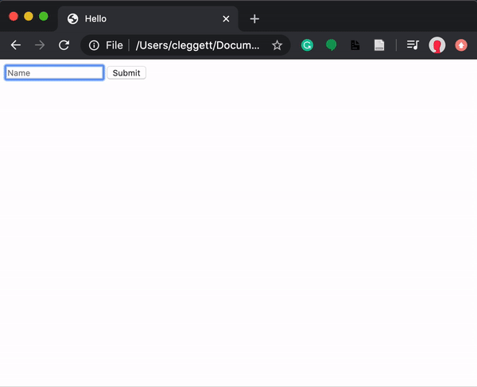{width="6.25in"
height="5.072916666666667in"}

Some notes about the page above:

-   We use the autofocus field in the name input to indicate that the
    > cursor should be set inside that input as soon as the page is
    > loaded.

-   We use #name inside of document.querySelector to find an element
    > with an id of name. We can use all the same selectors in this
    > function as we could in CSS.

-   We use the value attribute of an input field to find what is
    > currently typed in.

We can do more than just add HTML to our page using JavaScript, we can
also change the styling of a page! In the page below, we use buttons to
change the color of our heading.

&lt;!DOCTYPE html&gt;

&lt;html lang=&quot;en&quot;&gt;

&lt;head&gt;

&lt;title&gt;Colors&lt;/title&gt;

&lt;script&gt;

document.addEventListener(&apos;DOMContentLoaded&apos;, function() {

document.querySelectorAll(&apos;button&apos;).forEach(function(button) {

button.onclick = function() {

document.querySelector(&quot;#hello&quot;).style.color = button.dataset.color;

}

});

});

&lt;/script&gt;

&lt;/head&gt;

&lt;body&gt;

&lt;h1 id=&quot;hello&quot;&gt;Hello&lt;/h1&gt;

&lt;button data-color=&quot;red&quot;&gt;Red&lt;/button&gt;

&lt;button data-color=&quot;blue&quot;&gt;Blue&lt;/button&gt;

&lt;button data-color=&quot;green&quot;&gt;Green&lt;/button&gt;

&lt;/body&gt;

&lt;/html&gt;

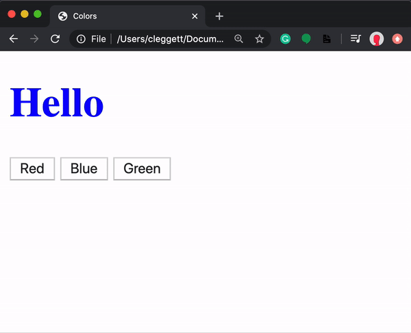{width="6.25in"
height="5.072916666666667in"}

Some notes on the page above:

-   We change the style of an element using
    > the style.SOMETHING attribute.

-   We use the data-SOMETHING attribute to assign data to an HTML
    > element. We can later access that data in JavaScript using the
    > element's dataset property.

-   We use the querySelectorAll function to get an [[Node
    > List]{.underline}](https://www.w3schools.com/js/js_htmldom_nodelist.asp) (similar
    > to a Python list or a
    > JavaScript [[array]{.underline}](https://www.w3schools.com/js/js_arrays.asp))
    > with all elements that match the query.

-   The [[forEach]{.underline}](https://www.w3schools.com/jsref/jsref_foreach.asp) function
    > in JavaScript takes in another function, and applies that function
    > to each element in a list or array.

### [[JavaScript Console]{.underline}](https://cs50.harvard.edu/web/2020/notes/5/#javascript-console)

The console is a useful tool for testing out small bits of code and
debugging. You can write and run JavaScript code in the console, which
can be found by inspecting element in your web browser and then
clicking console. (The exact process may change frome browser to
browser.) One useful tool for debugging is printing to the console,
which you can do using the console.log function. For example, in
the colors.html page above, I can add the following line:

console.log(document.querySelectorAll(&apos;button&apos;));

Which gives us this in the console:

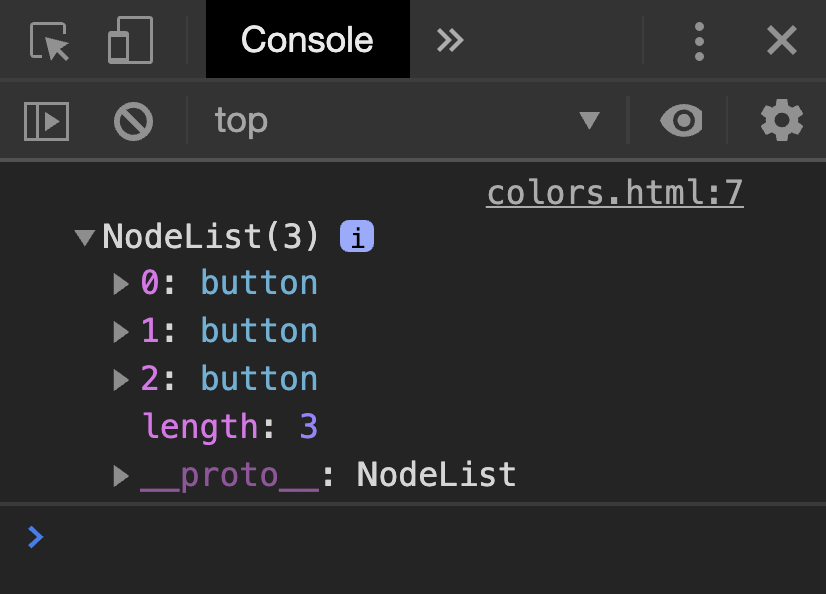{width="6.5in"
height="4.674305555555556in"}

### [[Arrow Functions]{.underline}](https://cs50.harvard.edu/web/2020/notes/5/#arrow-functions)

In addition to the traditional function notation we've seen already,
JavaScript now gives us the ability to use [[Arrow
Functions]{.underline}](https://www.w3schools.com/js/js_arrow_function.asp) where
we have an input (or parentheses when there's no input) followed
by =&gt; followed by some code to be run. For example, we can alter our
script above to use an anonymous arrow function:

document.addEventListener(&apos;DOMContentLoaded&apos;, () =&gt; {

document.querySelectorAll(&apos;button&apos;).forEach(button =&gt; {

button.onclick = () =&gt; {

document.querySelector(&quot;#hello&quot;).style.color = button.dataset.color;

}

});

});

We can also have named functions that use arrows, as in this rewriting
of the count function:

count = () =&gt; {

counter++;

document.querySelector(&apos;h1&apos;).innerHTML = counter;

if (counter % 10 === 0) {

alert(&ast;`Count is now &ast;${counter}&ast;`)

}

}

To get an idea about some other events we can use, let's see how we can
implement our color switcher using a dropdown menu instead of three
separate buttons. We can detect changes in a select element using
the onchange attribute. In
JavaScript, [[this]{.underline}](https://www.w3schools.com/js/js_this.asp) is
a keyword that changes based on the context in which it's used. In the
case of an event handler, this refers to the object that triggered the
event.

&lt;!DOCTYPE html&gt;

&lt;html lang=&quot;en&quot;&gt;

&lt;head&gt;

&lt;title&gt;Colors&lt;/title&gt;

&lt;script&gt;

document.addEventListener(&apos;DOMContentLoaded&apos;, function() {

document.querySelector(&apos;select&apos;).onchange = function() {

document.querySelector(&apos;#hello&apos;).style.color = this.value;

}

});

&lt;/script&gt;

&lt;/head&gt;

&lt;body&gt;

&lt;h1 id=&quot;hello&quot;&gt;Hello&lt;/h1&gt;

&lt;select&gt;

&lt;option value=&quot;black&quot;&gt;Black&lt;/option&gt;

&lt;option value=&quot;red&quot;&gt;Red&lt;/option&gt;

&lt;option value=&quot;blue&quot;&gt;Blue&lt;/option&gt;

&lt;option value=&quot;green&quot;&gt;Green&lt;/option&gt;

&lt;/select&gt;

&lt;/body&gt;

&lt;/html&gt;

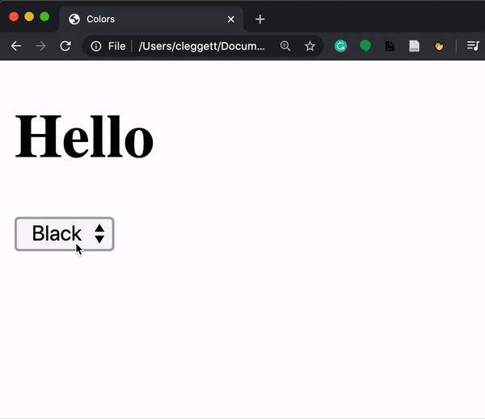{width="6.25in"
height="5.40625in"}

There are many
other [[events]{.underline}](https://www.w3schools.com/js/js_events.asp) we
can detect in JavaScript including the common ones below:

-   onclick

-   onmouseover

-   onkeydown

-   onkeyup

-   onload

-   onblur

-   ...

### [[TODO List]{.underline}](https://cs50.harvard.edu/web/2020/notes/5/#todo-list)

To put together a few of the things we've learned in this lecture, let's
work on making a TODO list entirely in JavaScript. We'll start by
writing the HTML layout of the page. Notice below how we leave space for
an unorderd list, but we dont yet add anything to it. Also notice that
we add a link to tasks.js where we'll write our JavaScript.

&lt;!DOCTYPE html&gt;

&lt;html lang=&quot;en&quot;&gt;

&lt;head&gt;

&lt;title&gt;Tasks&lt;/title&gt;

&lt;script src=&quot;tasks.js&quot;&gt;&lt;/script&gt;

&lt;/head&gt;

&lt;body&gt;

&lt;h1&gt;Tasks&lt;/h1&gt;

&lt;ul id=&quot;tasks&quot;&gt;&lt;/ul&gt;

&lt;form&gt;

&lt;input id=&quot;task&quot; placeholder = &quot;New Task&quot; type=&quot;text&quot;&gt;

&lt;input id=&quot;submit&quot; type=&quot;submit&quot;&gt;

&lt;/form&gt;

&lt;/body&gt;

&lt;/html&gt;

Now, here's our code which we can keep in tasks.js. A few notes on what
you'll see below:

-   This code is slightly different from the code in lecture. Here, we
    > only query for our submit button and input task field once in the
    > beginning and store those two values in the
    > variables submit and newTask.

-   We can enable/disable a button by setting its disabled attribute
    > to false/true.

-   In JavaScript, we use .length to find the length of objects such as
    > strings and arrays.

-   At the end of the script, we add the line return false. This
    > prevents the default submission of the form which involves either
    > reloading the current page or redirecting to a new one.

-   In JavaScript, we can create HTML elements using
    > the [[createElement]{.underline}](https://www.w3schools.com/jsref/met_document_createelement.asp) function.
    > We can then add those elements to the DOM using
    > the append function.

// Wait for page to load

document.addEventListener(&apos;DOMContentLoaded&apos;, function() {

// Select the submit button and input to be used later

const submit = document.querySelector(&apos;#submit&apos;);

const newTask = document.querySelector(&apos;#task&apos;);

// Disable submit button by default:

submit.disabled = true;

// Listen for input to be typed into the input field

newTask.onkeyup = () =&gt; {

if (newTask.value.length &gt; 0) {

submit.disabled = false;

}

else {

submit.disabled = true;

}

}

// Listen for submission of form

document.querySelector(&apos;form&apos;).onsubmit = () =&gt; {

// Find the task the user just submitted

const task = newTask.value;

// Create a list item for the new task and add the task to it

const li = document.createElement(&apos;li&apos;);

li.innerHTML = task;

// Add new element to our unordered list:

document.querySelector(&apos;#tasks&apos;).append(li);

// Clear out input field:

newTask.value = &apos;&apos;;

// Disable the submit button again:

submit.disabled = true;

// Stop form from submitting

return false;

}

});

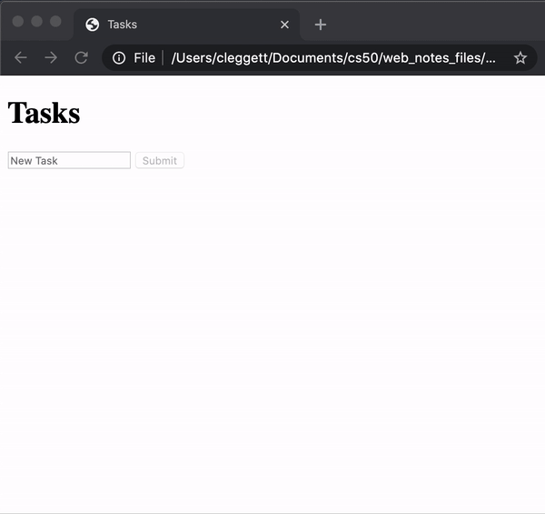{width="6.25in"
height="5.885416666666667in"}

## [[Intervals]{.underline}](https://cs50.harvard.edu/web/2020/notes/5/#intervals)

In addition to specifying that functions run when an event is triggered,
we can also set functions to run after a set amount of time. For
example, let's return to our counter page's script, and add an interval
so even if the user doesn't click anything, the counter increments every
second. To do this, we use
the [[setInterval]{.underline}](https://www.w3schools.com/jsref/met_win_setinterval.asp) function,
which takes as argument a function to be run, and a time (in
milliseconds) between function runs.

let counter = 0;

function count() {

counter++;

document.querySelector(&apos;h1&apos;).innerHTML = counter;

}

document.addEventListener(&apos;DOMContentLoaded&apos;, function() {

document.querySelector(&apos;button&apos;).onclick = count;

setInterval(count, 1000);

});

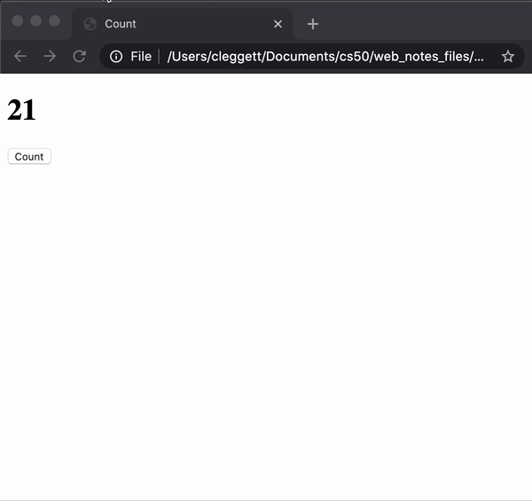{width="6.25in"
height="5.885416666666667in"}

## [[Local Storage]{.underline}](https://cs50.harvard.edu/web/2020/notes/5/#local-storage)

One thing to notice about all of our sites so far is that every time we
reload the page, all of our information is lost. The heading color goes
back to black, the counter goes back to 0, and all of the tasks are
erased. Sometimes this is what we intend, but other time's we'll want to
be able to store information that we can use when a user returns to the
site.

One way we can do this is by using [[Local
Storage]{.underline}](https://www.w3schools.com/jsref/prop_win_localstorage.asp),
or storing information on the user's web browser that we can access
later. This information is stored as a set of key-value pairs, almost
like a Python dictionary. In order to use local storage, we'll employ
two key functions:

-   localStorage.getItem(key): This function searches for an entry in
    > local storage with a given key, and returns the value associated
    > with that key.

-   localStorage.setItem(key, value): This function sets and entry in
    > local storage, associating the key with a new vlaue.

Let's look at how we can use these new functions to update our counter!
In the code below,

// Check if there is already a vlaue in local storage

if (!localStorage.getItem(&apos;counter&apos;)) {

// If not, set the counter to 0 in local storage

localStorage.setItem(&apos;counter&apos;, 0);

}

function count() {

// Retrieve counter value from local storage

let counter = localStorage.getItem(&apos;counter&apos;);

// update counter

counter++;

document.querySelector(&apos;h1&apos;).innerHTML = counter;

// Store counter in local storage

localStorage.setItem(&apos;counter&apos;, counter);

}

document.addEventListener(&apos;DOMContentLoaded&apos;, function() {

// Set heading to the current value inside local storage

document.querySelector(&apos;h1&apos;).innerHTML =
localStorage.getItem(&apos;counter&apos;);

document.querySelector(&apos;button&apos;).onclick = count;

});

## [[APIs]{.underline}](https://cs50.harvard.edu/web/2020/notes/5/#apis)

### [[JavaScript Objects]{.underline}](https://cs50.harvard.edu/web/2020/notes/5/#javascript-objects)

A [[JavaScript
Object]{.underline}](https://www.w3schools.com/js/js_objects.asp) is
very similar to a Python dictionary, as it allows us to store key-value
pairs. For example, I could create a JavaScript Object representing
Harry Potter:

let person = {

first: &apos;Harry&apos;,

last: &apos;Potter&apos;

};

I can then access or change parts of this object using either bracket or
dot notation:

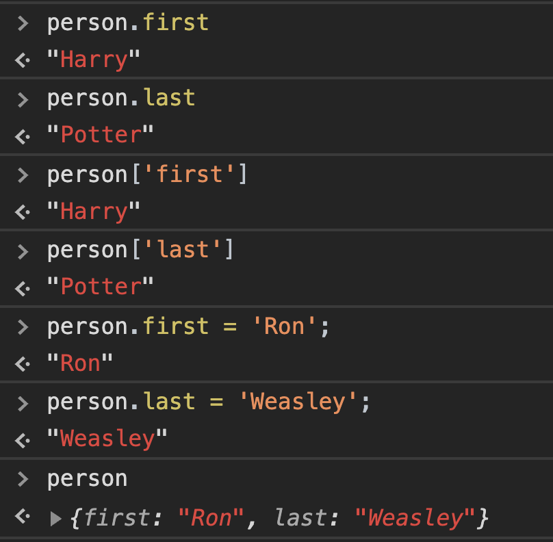{width="4.0in"
height="3.920931758530184in"}

**One way in which JavaScript Objects are really useful is in
transferring data from one site to another, particularly when
using [[APIs]{.underline}](https://www.mulesoft.com/resources/api/what-is-an-api)**

> An API, or Application Programming Interface, is a structured form
> communication between two different applications.

For example, we may want our application to get information from Google
Maps, Amazon, or some weather service. We can do this by making calls to
a service's API, which will return structured data to us, often
in [[JSON]{.underline}](https://www.w3schools.com/js/js_json_intro.asp) (JavaScript
Object Notation) form. For example, a flight in JSON form might look
like this:

{

&quot;origin&quot;: &quot;New York&quot;,

&quot;destination&quot;: &quot;London&quot;,

&quot;duration&quot;: 415

}

The values within a JSON do not have to just be strings and numbers as
in the example above. We can also store lists, or even other JavaScript
Objects:

{

&quot;origin&quot;: {

&quot;city&quot;: &quot;New York&quot;,

&quot;code&quot;: &quot;JFK&quot;

},

&quot;destination&quot;: {

&quot;city&quot;: &quot;London&quot;,

&quot;code&quot;: &quot;LHR&quot;

},

&quot;duration&quot;: 415

}

### [[Currency Exchange]{.underline}](https://cs50.harvard.edu/web/2020/notes/5/#currency-exchange)

To show how we can use APIs in our applications, let's work on building
an application where we can find exchange rates between two currencies.
Throughout the exercise, we'll be using the [[European Central Bank's
Exchange Rate API]{.underline}](https://exchangeratesapi.io/). By
visiting their website, you'll see the API's documentation, which is
generally a good place to start when you wish to use an API. We can test
this api by visiting the
URL: [[https://api.exchangeratesapi.io/latest?base=USD]{.underline}](https://api.exchangeratesapi.io/latest?base=USD).
When you visit this page, you'll see the exchange rate between the U.S.
Dollar and many other currencies, written in JSON form. You can also
change the GET parameter in the URL from USD to any other currency code
to change the rates you get.

Let's take a look at how to implement this API into an application by
creating a new HTML file called currency.html and link it to a
JavaScript file but leave the body empty:

&lt;!DOCTYPE html&gt;

&lt;html lang=&quot;en&quot;&gt;

&lt;head&gt;

&lt;title&gt;Currency Exchange&lt;/title&gt;

&lt;script src=&quot;currency.js&quot;&gt;&lt;/script&gt;

&lt;/head&gt;

&lt;body&gt;&lt;/body&gt;

&lt;/html&gt;

Now, we'll use something
called [[AJAX]{.underline}](https://www.w3schools.com/js/js_ajax_intro.asp),
or Asynchronous JavaScript And XML, which allows us to access
information from external pages even after our page has loaded. In order
to do this, we'll use
the [[fetch]{.underline}](https://javascript.info/fetch) function which
will allow us to send an HTTP request. The fetch function returns
a [[promise]{.underline}](https://web.dev/promises/). We won't talk
about the details of what a promise is here, but we can think of it as a
value that will come through at some point, but not necessarily right
away. We deal with promises by giving them a .then attribute describing
what should be done when we get a response. The code snippet below will
log our response to the console.

document.addEventListener(&apos;DOMContentLoaded&apos;, function() {

// Send a GET request to the URL

fetch(&apos;https://api.exchangeratesapi.io/latest?base=USD&apos;)

// Put response into json form

.then(response =&gt; response.json())

.then(data =&gt; {

// Log data to the console

console.log(data);

});

});

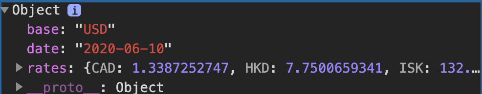{width="6.5in"
height="1.2791666666666666in"}

One important point about the above code is that the argument
of .then is always a function. Although it seems we are creating the
variables response and and data, those variables are just the parameters
of two anonymous functions.

Rather than simply logging this data, we can use JavaScript to display a
message to the screen, as in the code below:

document.addEventListener(&apos;DOMContentLoaded&apos;, function() {

// Send a GET request to the URL

fetch(&apos;https://api.exchangeratesapi.io/latest?base=USD&apos;)

// Put response into json form

.then(response =&gt; response.json())

.then(data =&gt; {

// Get rate from data

const rate = data.rates.EUR;

// Display message on the screen

document.querySelector(&apos;body&apos;).innerHTML = &ast;`1 USD is equal to
&ast;${rate.toFixed(3)} EUR.&ast;`;

});

});

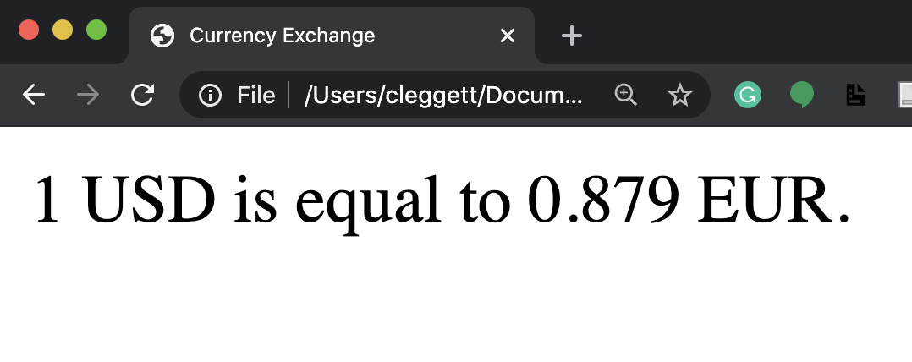{width="6.5in"
height="2.5805555555555557in"}

Now, let's make the site a bit more interactive by allowing the user to
choose which currency they would like to see. We'll start by altering
our HTML to allow the user to input a currency:

&lt;!DOCTYPE html&gt;

&lt;html lang=&quot;en&quot;&gt;

&lt;head&gt;

&lt;title&gt;Currency Exchange&lt;/title&gt;

&lt;script src=&quot;currency.js&quot;&gt;&lt;/script&gt;

&lt;/head&gt;

&lt;body&gt;

&lt;form&gt;

&lt;input id=&quot;currency&quot; placeholder=&quot;Currency&quot; type=&quot;text&quot;&gt;

&lt;input type=&quot;submit&quot; value=&quot;Convert&quot;&gt;

&lt;/form&gt;

&lt;div id=&quot;result&quot;&gt;&lt;/div&gt;

&lt;/body&gt;

&lt;/html&gt;

Now, we'll make some changes to our JavaScript so it only changes when
the form is submitted, and so it takes into account the user's input.
We'll also add some error checking here:

document.addEventListener(&apos;DOMContentLoaded&apos;, function() {

document.querySelector(&apos;form&apos;).onsubmit = function() {

// Send a GET request to the URL

fetch(&apos;https://api.exchangeratesapi.io/latest?base=USD&apos;)

// Put response into json form

.then(response =&gt; response.json())

.then(data =&gt; {

// Get currency from user input and convert to upper case

const currency =
document.querySelector(&apos;#currency&apos;).value.toUpperCase();

// Get rate from data

const rate = data.rates&lbrack;currency&rbrack;;

// Check if currency is valid:

if (rate !== undefined) {

// Display exchange on the screen

document.querySelector(&apos;#result&apos;).innerHTML = &ast;`1 USD is equal to
&ast;${rate.toFixed(3)} &ast;${currency}.&ast;`;

}

else {

// Display error on the screen

document.querySelector(&apos;#result&apos;).innerHTML = &apos;Invalid Currency.&apos;;

}

})

// Catch any errors and log them to the console

.catch(error =&gt; {

console.log(&apos;Error:&apos;, error);

});

// Prevent default submission

return false;

}

});

{width="6.25in"
height="5.28125in"}

That's all for this lecture! Next time, we'll work on using JavaScript
to create even more engaging user interfaces!
